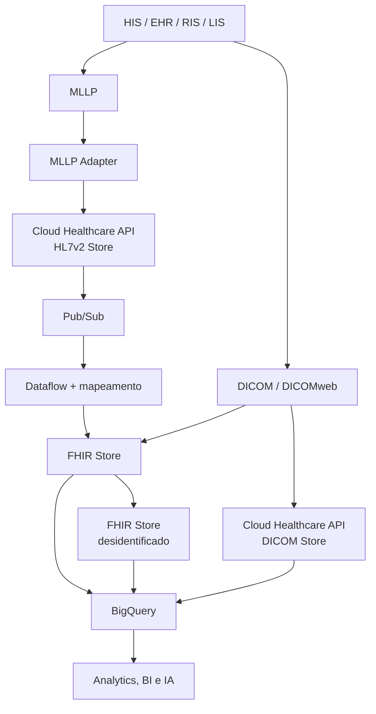

# Healthcare Interoperability Labs

Documentação técnica de laboratórios práticos com a **Google Cloud Healthcare API**, voltados à interoperabilidade de dados em saúde.

O repositório registra, de forma reproduzível e orientada a portfólio, a evolução de uma arquitetura que recebe mensagens clínicas legadas em **HL7v2**, estrutura dados no padrão **FHIR** e integra metadados de imagem médica em **DICOM** para análise.

> Os laboratórios foram executados em ambientes temporários de treinamento. As mensagens utilizadas são de demonstração; nenhum dado real de paciente é armazenado neste repositório.

## Objetivo

Demonstrar conhecimento prático em integração de sistemas de saúde, mensageria, APIs, dados clínicos e serviços gerenciados do Google Cloud.

A trilha conecta quatro níveis de implementação:

1. **Ingestão HL7v2:** recebimento seguro de mensagens clínicas por MLLP e persistência na Healthcare API.
2. **Streaming HL7v2 para FHIR:** transformação de dados clínicos em recursos FHIR e entrega para consumo analítico no BigQuery.
3. **Ingestão DICOM:** importação de imagens médicas, exportação de metadados e consultas analíticas no BigQuery.
4. **Ingestão direta de FHIR:** importação, desidentificação, exportação e streaming de recursos FHIR R4.

## Arquitetura consolidada

Leia a explicação detalhada em [Arquitetura](docs/architecture.md).

## Laboratórios documentados

| Status | Laboratório | Foco |
|---|---|---|
| Concluído | [Ingesting HL7v2 Data with the Healthcare API](docs/01-ingesting-hl7v2.md) | Receber e armazenar mensagens HL7v2 via MLLP |
| Concluído | [Streaming HL7 to FHIR Data with Healthcare API](docs/02-streaming-hl7v2-to-fhir.md) | Transformar dados HL7v2 em FHIR e disponibilizá-los no BigQuery |
| Concluído | [Ingesting DICOM Data with the Healthcare API](docs/03-ingesting-dicom.md) | Importar estudos DICOM e exportar metadados para análise no BigQuery |
| Concluído | [Ingesting FHIR Data with the Healthcare API](docs/04-ingesting-fhir.md) | Importar, desidentificar e transmitir recursos FHIR R4 para o BigQuery |
| Próximo | [Roadmap](docs/roadmap.md) | Evolução para uma plataforma de referência de interoperabilidade |

## Evidências e documentação

- [Mapa de evidências](docs/evidence.md): quais prints usar e o que cada um comprova.
- [Arquitetura](docs/architecture.md): componentes, fluxo e aplicação em produção.
- [Roadmap](docs/roadmap.md): continuidade da trilha com FHIR e DICOM.

## Competências praticadas

- Google Cloud Healthcare API
- HL7v2, MLLP, FHIR e DICOM/DICOMweb
- Cloud Pub/Sub e Dataflow
- BigQuery e dados clínicos
- GKE, containers Docker e Kubernetes
- IAM e contas de serviço
- APIs REST, `curl` e `gcloud`
- Desidentificação de dados FHIR e streaming para BigQuery
- Arquitetura de integração hospitalar
- Troubleshooting de payloads e redirecionamentos HTTP

## Aplicação no mundo real

Essa arquitetura é aplicável a cenários em que sistemas hospitalares legados precisam interoperar com plataformas clínicas modernas, analytics e modelos de IA, sem substituir imediatamente HIS, LIS, RIS ou PACS já existentes.

Ela ajuda a:

- reduzir integrações ponto a ponto;
- desacoplar produtores e consumidores de eventos clínicos;
- criar trilhas de auditoria e observabilidade;
- estruturar dados em padrões amplamente adotados;
- acelerar relatórios, indicadores, pesquisa e automações assistenciais.

## Autor

**Fernando Henrique Cerqueira**  
Analista de Sistemas | Healthcare IT | Integrações, Sustentação e Dados Clínicos  
[GitHub](https://github.com/fernandocerqueira1990-cloud)
