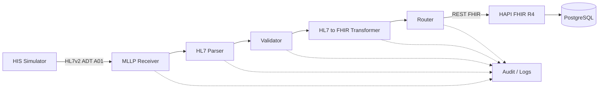

# Healthcare Interoperability Labs

> Evolução prática de estudos de interoperabilidade em saúde para um **Healthcare Integration Gateway** modular, reproduzível e preparado para evoluir de laboratório para PoC, MVP, piloto e produto.

Este repositório reúne duas frentes complementares:

1. **Laboratórios em Google Cloud Healthcare API** — HL7v2, FHIR, DICOM/DICOMweb, Pub/Sub, Dataflow e BigQuery.
2. **Healthcare Integration Gateway** — implementação local para receber, validar, transformar, rotear e persistir fluxos de interoperabilidade em saúde.

> Todos os exemplos públicos usam dados fictícios ou sintéticos.

---

## Status atual

**MVP v0.1 — Milestones 1.1 e 1.2 concluídos e validados**

### ✅ Milestone 1.1 — Ambiente FHIR Local

- HAPI FHIR R4 `8.10.0`;
- PostgreSQL `16-alpine`;
- Docker Compose;
- persistência em volume Docker;
- `CapabilityStatement` validado;
- `Patient` criado via REST;
- busca por `Patient.identifier` validada;
- persistência confirmada após recriação dos containers.

### ✅ Milestone 1.2 — HIS Simulator + HL7v2 ADT^A01

- mensagem HL7v2 `ADT^A01` sintética;
- segmentos `MSH`, `EVN`, `PID` e `PV1`;
- inspeção automatizada de campos;
- tratamento específico do parsing de `MSH`;
- validação estrutural mínima;
- validação de `MSH-9`, `MSH-10`, `MSH-12`, `PID-3`, `PID-5`, `PV1-2`, `PV1-19` e `PV1-44`;
- happy path com `VALIDATION RESULT: PASS`;
- teste negativo controlado removendo `PV1-19`;
- detecção com `VALIDATION RESULT: FAIL`;
- restauração e revalidação com `PASS`;
- troubleshooting documentado para deslocamento de campos no `PV1`.

### 🔜 Próximo: Milestone 1.3 — Transporte MLLP + ACK/NACK

Objetivos:

- criar receptor MLLP;
- transmitir `ADT^A01`;
- interpretar framing MLLP;
- gerar ACK positivo e respostas de erro;
- correlacionar ACK com `Message Control ID`;
- registrar logs e evidências de transporte.

---

## Arquitetura do produto



### Fluxo implementado hoje

```text
HIS Simulator
      |
      v
HL7v2 ADT^A01
      |
      +--> Inspector
      |
      `--> Structural Validator
              |
              +--> PASS
              `--> FAIL

HAPI FHIR R4
      |
      | JDBC
      v
PostgreSQL
      |
      v
Docker Volume
```

### Próximo fluxo

```text
HIS Simulator
      |
      | HL7v2 ADT^A01 / MLLP
      v
MLLP Receiver
      |
      v
Parser -> Validator
      |
      +--> ACK / NACK
      |
      v
Transformer -> FHIR Patient + Encounter
```

---

## Roadmap

| Etapa | Escopo | Status |
|---|---|---|
| MVP v0.1 / 1.1 | Ambiente FHIR local — HAPI FHIR + PostgreSQL | ✅ Concluído |
| MVP v0.1 / 1.2 | HIS Simulator + HL7v2 ADT^A01 | ✅ Concluído |
| MVP v0.1 / 1.3 | Transporte MLLP + ACK/NACK | 🔜 Próximo |
| MVP v0.1 / 1.4 | Parser + Validator HL7v2 | Planejado |
| MVP v0.1 / 1.5 | ADT^A01 → FHIR Patient + Encounter | Planejado |
| MVP v0.1 / 1.6 | Pipeline end-to-end | Planejado |
| v0.2 | ORM / ORU → ServiceRequest / Observation / DiagnosticReport | Planejado |
| v0.3 | REST API Gateway e webhooks | Planejado |
| v0.4 | Dashboard operacional | Planejado |
| v0.5 | Configuração multi-cliente | Planejado |
| v0.6 | Observabilidade avançada | Planejado |
| v0.7 | DICOM / DICOMweb | Planejado |
| v0.8 | Rules Engine | Planejado |
| v0.9 | Assistente de troubleshooting com IA | Planejado |
| v1.0 | Piloto controlado / plataforma de referência | Futuro |

---

## Documentação

A regra do projeto é:

**teoria → motivo → implementação → teste → validação → troubleshooting → evidência**

### Produto e arquitetura

- [Índice da documentação](docs/README.md)
- [Product Vision](docs/product-vision.md)
- [Arquitetura v0.1](docs/architecture/01-overview.md)
- [Fluxo ADT^A01 → FHIR](docs/architecture/02-adt-a01-flow.md)
- [Status do projeto](docs/project-status.md)

### Implementação

- [01 — Ambiente FHIR local](docs/implementation/01-local-fhir-environment.md)
- [02 — HIS Simulator + HL7v2 ADT^A01](docs/implementation/02-his-simulator-adt-a01.md)

### Evidências

- [Validação do ambiente FHIR local](docs/evidence/mvp-v0.1-local-fhir-validation.md)
- [Validação do HIS Simulator / ADT^A01](docs/evidence/mvp-v0.1-his-simulator-validation.md)

### Relatórios

- [Milestone 1.1](docs/reports/01-milestone-1.1-summary.md)
- [Milestone 1.2](docs/reports/02-milestone-1.2-summary.md)

### Guia de estudo

- [InterSystems Technical Specialist — Guia de estudo](docs/study/intersystems-technical-specialist-interview-guide.md)

### Labs Google Cloud

- [Ingesting HL7v2](docs/01-ingesting-hl7v2.md)
- [Streaming HL7v2 to FHIR](docs/02-streaming-hl7v2-to-fhir.md)
- [Ingesting DICOM](docs/03-ingesting-dicom.md)
- [Ingesting FHIR](docs/04-ingesting-fhir.md)

---

## Executando o laboratório

### Subir HAPI FHIR + PostgreSQL

```bash
cd docker
docker compose up -d
```

### Verificar serviços

```bash
docker compose ps
```

### Inspecionar ADT^A01

```bash
python3 src/his-simulator/tools/inspect_hl7.py
```

### Validar ADT^A01

```bash
python3 src/his-simulator/tools/validate_adt_a01.py
```

Happy path esperado:

```text
VALIDATION RESULT: PASS
```

---

## Estrutura atual

```text
healthcare-interoperability-labs/
├── README.md
├── LICENSE
├── docker/
│   ├── docker-compose.yml
│   └── hapi.application.yaml
├── src/
│   └── his-simulator/
│       ├── messages/
│       │   └── adt_a01.hl7
│       └── tools/
│           ├── inspect_hl7.py
│           └── validate_adt_a01.py
├── docs/
│   ├── README.md
│   ├── product-vision.md
│   ├── project-status.md
│   ├── architecture/
│   │   ├── 01-overview.md
│   │   └── 02-adt-a01-flow.md
│   ├── implementation/
│   │   ├── 01-local-fhir-environment.md
│   │   └── 02-his-simulator-adt-a01.md
│   ├── evidence/
│   │   ├── mvp-v0.1-local-fhir-validation.md
│   │   └── mvp-v0.1-his-simulator-validation.md
│   ├── reports/
│   │   ├── 01-milestone-1.1-summary.md
│   │   └── 02-milestone-1.2-summary.md
│   └── study/
│       └── intersystems-technical-specialist-interview-guide.md
└── assets/
    └── README.md
```

---

## Princípios técnicos

- modularidade;
- baixo acoplamento;
- configuração por cliente;
- dados sintéticos em ambiente público;
- infraestrutura reproduzível;
- validação incremental;
- documentação junto com código;
- troubleshooting documentado;
- observabilidade como requisito arquitetural.

---

## Competências praticadas

- Healthcare IT e interoperabilidade;
- HL7v2 / ADT^A01;
- parsing e validação estrutural;
- FHIR R4;
- HAPI FHIR;
- PostgreSQL;
- Docker / Docker Compose;
- Python;
- REST APIs;
- DICOM / DICOMweb;
- Google Cloud Healthcare API;
- arquitetura de integração hospitalar;
- troubleshooting e validação técnica.
