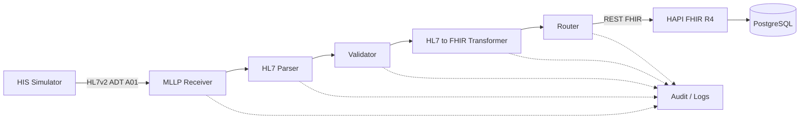

# Healthcare Interoperability Labs

> Evolução prática de estudos de interoperabilidade em saúde para um **Healthcare Integration Gateway** modular, reproduzível e preparado para evoluir de laboratório para PoC, MVP, piloto e produto.

Este repositório reúne duas frentes complementares:

1. **Laboratórios de interoperabilidade em Google Cloud Healthcare API** — HL7v2, FHIR, DICOM/DICOMweb, Pub/Sub, Dataflow e BigQuery.
2. **Healthcare Integration Gateway** — implementação local e modular para receber, validar, transformar, rotear, persistir e futuramente observar fluxos de interoperabilidade em saúde.

> Todos os exemplos públicos utilizam dados fictícios ou sintéticos. Nenhum dado real de paciente deve ser armazenado neste repositório.

---

## Status atual

**MVP v0.1 — Milestone 1.1 concluído: Ambiente FHIR Local**

Nesta primeira etapa do produto foram implementados e validados:

- HAPI FHIR R4 `8.10.0` em container;
- PostgreSQL `16-alpine` como persistência;
- Docker Compose para orquestração;
- rede interna entre os serviços;
- volume Docker para persistência;
- endpoint `/fhir/metadata` respondendo com `CapabilityStatement`;
- criação de `Patient` via `POST /fhir/Patient` com HTTP `201`;
- busca por `Patient.identifier` retornando `Bundle` com `total: 1`;
- persistência comprovada após remoção e recriação dos containers.

### Validações concluídas

```text
[x] PostgreSQL saudável
[x] HAPI FHIR em execução
[x] /fhir/metadata respondendo
[x] Patient sintético criado
[x] Patient recuperado via busca
[x] Persistência após reinício
```

---

## Visão do produto

O **Healthcare Integration Gateway** está sendo desenvolvido como uma camada intermediária entre sistemas de saúde heterogêneos.

```text
Sistema de origem
       |
       v
Healthcare Integration Gateway
       |
       v
Sistema de destino
```

Responsabilidades planejadas:

- receber dados por MLLP, REST e outros canais;
- fazer parsing e interpretação;
- validar estrutura e regras de integração;
- transformar formatos e padrões;
- rotear para diferentes destinos;
- registrar auditoria, logs e rastreabilidade;
- implementar retry e tratamento controlado de falhas;
- permitir configuração por cliente sem alterar o core.

Leia: [Product Vision](docs/product-vision.md)

---

## Arquitetura MVP v0.1



### Fluxo atual implementado

```text
Developer / Gateway
        |
        | HTTP REST :8080
        v
   HAPI FHIR R4
        |
        | JDBC :5432
        v
     PostgreSQL
        |
        v
   Docker Volume
```

### Próximo fluxo

```text
HIS Simulator
      |
      v
HL7v2 ADT^A01
      |
      v
MLLP
      |
      v
Parser -> Validator -> Transformer
      |
      v
FHIR Patient + Encounter
```

---

## Roadmap do Healthcare Integration Gateway

| Versão / Etapa | Escopo | Status |
|---|---|---|
| MVP v0.1 / 1.1 | Ambiente FHIR local — HAPI FHIR + PostgreSQL | ✅ Concluído |
| MVP v0.1 / 1.2 | HIS Simulator + HL7v2 ADT^A01 | 🔜 Próximo |
| MVP v0.1 / 1.3 | Transporte MLLP + ACK | Planejado |
| MVP v0.1 / 1.4 | Parser + Validator HL7v2 | Planejado |
| MVP v0.1 / 1.5 | Transformação ADT^A01 → Patient + Encounter | Planejado |
| MVP v0.1 / 1.6 | Pipeline end-to-end | Planejado |
| v0.2 | ORM / ORU → ServiceRequest / Observation / DiagnosticReport | Planejado |
| v0.3 | REST API Gateway e webhooks | Planejado |
| v0.4 | Dashboard operacional | Planejado |
| v0.5 | Configuração multi-cliente | Planejado |
| v0.6 | Observabilidade avançada | Planejado |
| v0.7 | DICOM / DICOMweb | Planejado |
| v0.8 | Rules Engine | Planejado |
| v0.9 | Assistente de troubleshooting com IA | Planejado |
| v1.0 | Piloto controlado / plataforma de referência | Futuro |

---

## Documentação do projeto

A documentação segue uma regra: **teoria → motivo → implementação → teste → validação → troubleshooting → evidência**.

### Produto e arquitetura

- [Índice da documentação](docs/README.md)
- [Product Vision](docs/product-vision.md)
- [Arquitetura v0.1](docs/architecture/01-overview.md)
- [Fluxo ADT^A01 → FHIR](docs/architecture/02-adt-a01-flow.md)
- [Status do projeto](docs/project-status.md)

### Implementação atual

- [Ambiente FHIR local](docs/implementation/01-local-fhir-environment.md)
- [Evidência — validação do ambiente FHIR local](docs/evidence/mvp-v0.1-local-fhir-validation.md)

### Laboratórios Google Cloud já concluídos

- [Ingesting HL7v2 Data with the Healthcare API](docs/01-ingesting-hl7v2.md)
- [Streaming HL7 to FHIR Data with Healthcare API](docs/02-streaming-hl7v2-to-fhir.md)
- [Ingesting DICOM Data with the Healthcare API](docs/03-ingesting-dicom.md)
- [Ingesting FHIR Data with the Healthcare API](docs/04-ingesting-fhir.md)
- [Arquitetura dos labs Google Cloud](docs/architecture.md)
- [Mapa de evidências dos labs](docs/evidence.md)
- [Roadmap original](docs/roadmap.md)

---

## Executando o ambiente FHIR local

### Pré-requisitos

- Docker
- Docker Compose
- Git

### Subir o ambiente

```bash
git clone https://github.com/fernandocerqueira1990-cloud/healthcare-interoperability-labs.git
cd healthcare-interoperability-labs/docker
docker compose up -d
```

### Verificar os serviços

```bash
docker compose ps
```

### CapabilityStatement

```bash
curl -s http://localhost:8080/fhir/metadata | head -n 30
```

### Criar um Patient sintético

```bash
curl -i -X POST http://localhost:8080/fhir/Patient \
  -H "Content-Type: application/fhir+json" \
  -d '{
    "resourceType":"Patient",
    "identifier":[{
      "system":"https://hospital-demo.local/mrn",
      "value":"789012"
    }],
    "name":[{
      "family":"Santos",
      "given":["Marina"]
    }],
    "gender":"female",
    "birthDate":"1992-08-10"
  }'
```

### Buscar pelo identificador de negócio

```bash
curl -s "http://localhost:8080/fhir/Patient?identifier=789012" | jq '{
  resourceType,
  type,
  total,
  patient: .entry[0].resource
}'
```

> Credenciais e dados desta configuração são exclusivamente para desenvolvimento local. Não reutilizar em produção.

---

## Estrutura atual do repositório

```text
healthcare-interoperability-labs/
├── README.md
├── LICENSE
├── docker/
│   ├── docker-compose.yml
│   └── hapi.application.yaml
├── docs/
│   ├── README.md
│   ├── product-vision.md
│   ├── project-status.md
│   ├── architecture/
│   │   ├── 01-overview.md
│   │   └── 02-adt-a01-flow.md
│   ├── implementation/
│   │   └── 01-local-fhir-environment.md
│   ├── evidence/
│   │   └── mvp-v0.1-local-fhir-validation.md
│   ├── 01-ingesting-hl7v2.md
│   ├── 02-streaming-hl7v2-to-fhir.md
│   ├── 03-ingesting-dicom.md
│   └── 04-ingesting-fhir.md
└── assets/
```

A estrutura será expandida gradualmente conforme cada componente for implementado.

---

## Princípios técnicos adotados

- modularidade;
- baixo acoplamento;
- configuração por cliente;
- observabilidade desde o início;
- dados sintéticos em ambiente público;
- infraestrutura reproduzível;
- validação incremental;
- documentação junto com código;
- troubleshooting documentado quando tecnicamente relevante.

---

## Competências praticadas

- Healthcare IT e interoperabilidade
- HL7v2 e MLLP
- FHIR R4
- DICOM / DICOMweb
- HAPI FHIR
- PostgreSQL
- Docker e Docker Compose
- REST APIs e `curl`
- Google Cloud Healthcare API
- Pub/Sub e Dataflow
- BigQuery
- GKE / containers
- arquitetura de integração hospitalar
- troubleshooting e validação técnica

---

## Autor

**Fernando Henrique Cerqueira**  
Senior Systems Analyst & Healthcare IT Specialist  
Healthcare IT | Integrações | Sustentação | Dados Clínicos | HL7 / FHIR

[GitHub](https://github.com/fernandocerqueira1990-cloud) · [LinkedIn](https://www.linkedin.com/in/fernando-cerqueira-it/)
