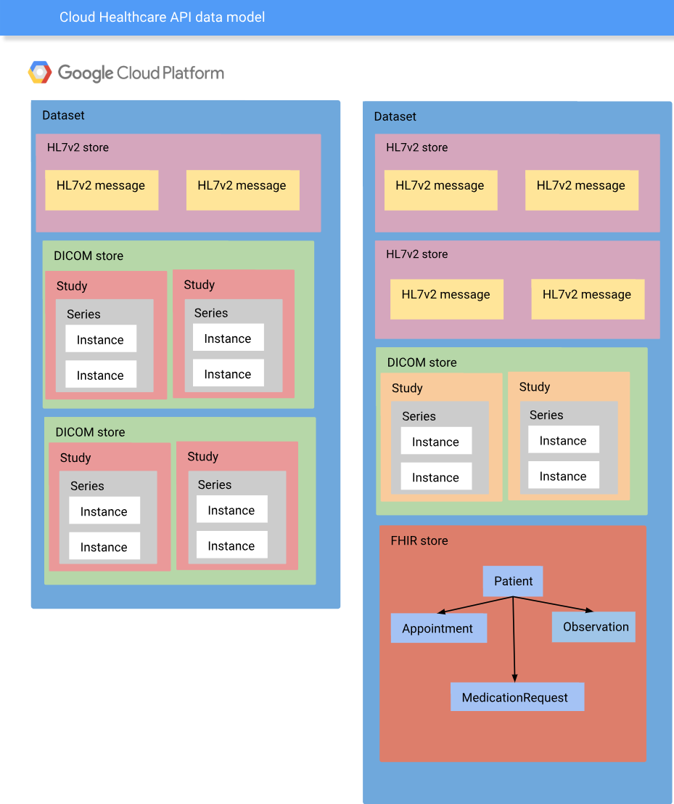
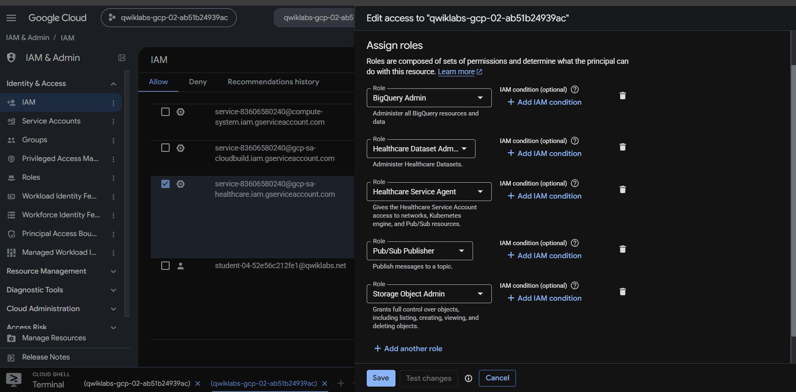
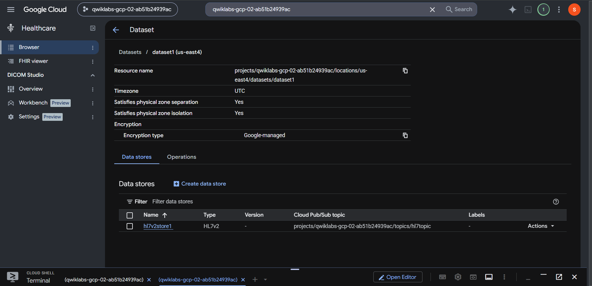
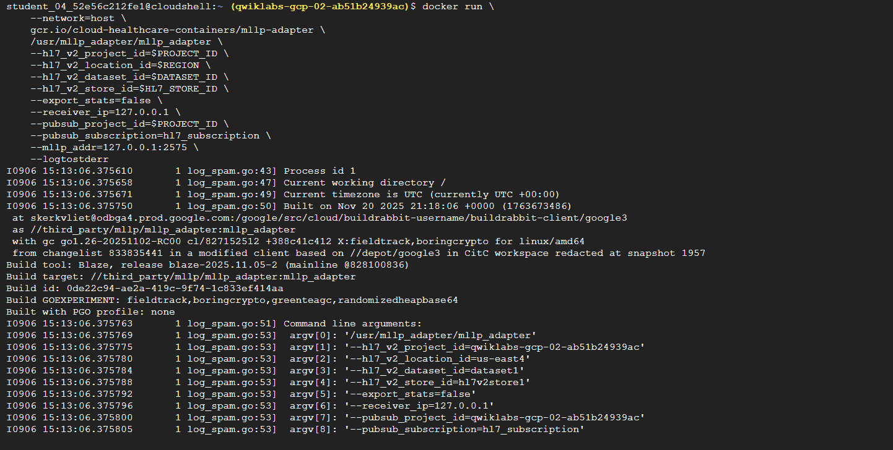
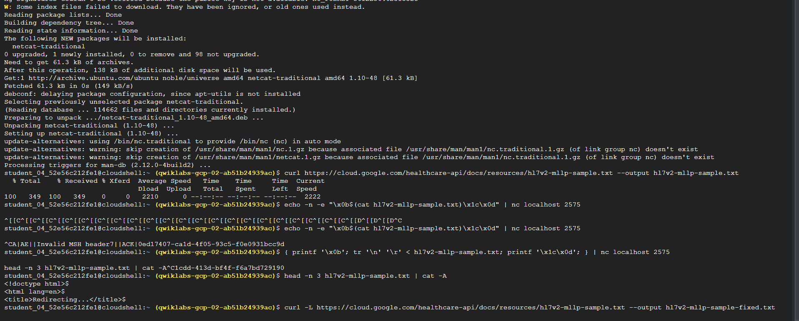
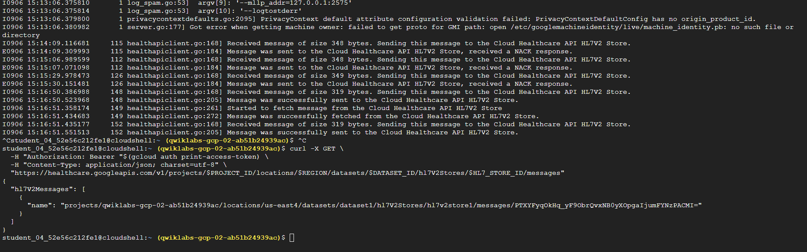

# Lab 01 — Ingesting HL7v2 Data with the Healthcare API

## Objetivo

Validar a ingestão de uma mensagem HL7v2 em um repositório da Google Cloud Healthcare API usando o protocolo **MLLP** (Minimal Lower Layer Protocol).

O laboratório demonstra a etapa mais fundamental de uma integração clínica em cloud: receber uma mensagem de um sistema legado, confirmar seu processamento e mantê-la disponível para consulta.

## Resultado alcançado

- Dataset da Healthcare API criado na região `us-east4`;
- tópico e assinatura Pub/Sub configurados;
- repositório HL7v2 criado e conectado ao tópico;
- adaptador MLLP executado em container Docker;
- mensagem de exemplo enviada localmente para a porta MLLP;
- confirmação positiva `MSA|AA|` recebida;
- mensagem consultada com sucesso no HL7v2 Store via API REST.

## Componentes utilizados

| Serviço ou ferramenta | Uso no laboratório |
|---|---|
| Cloud Healthcare API | Dataset e HL7v2 Store |
| Cloud Pub/Sub | Notificação de novas mensagens ingeridas |
| Docker | Execução do adaptador MLLP |
| Netcat | Envio da mensagem para o listener MLLP |
| IAM | Permissões do service agent da Healthcare API |
| Cloud Shell | Execução dos comandos `gcloud`, `curl` e Docker |

## Implementação

### 1. Criar o dataset

O dataset é o contêiner lógico que organiza os repositórios de dados clínicos da Healthcare API.

```bash
gcloud healthcare datasets create dataset1 --location=us-east4
```

### 2. Configurar IAM

O service agent da Cloud Healthcare API recebeu permissões necessárias para o fluxo de integração, incluindo:

- Healthcare Dataset Administrator;
- Pub/Sub Publisher;
- BigQuery Admin;
- Storage Object Admin.

Em um ambiente produtivo, as permissões devem ser reduzidas ao menor conjunto necessário para cada função.

### 3. Definir variáveis de ambiente

```bash
export PROJECT_ID=$(gcloud config get-value project)
export REGION=us-east4
export DATASET_ID=dataset1
export HL7_STORE_ID=hl7v2store1
```

### 4. Criar Pub/Sub

```bash
gcloud pubsub topics create projects/$PROJECT_ID/topics/hl7topic
gcloud pubsub subscriptions create hl7_subscription --topic=hl7topic
```

O Pub/Sub permite que a chegada de uma mensagem HL7v2 seja comunicada a outros componentes sem acoplamento direto.

### 5. Criar o HL7v2 Store

```bash
gcloud healthcare hl7v2-stores create $HL7_STORE_ID \
  --dataset=$DATASET_ID \
  --location=$REGION \
  --notification-config=pubsub-topic=projects/$PROJECT_ID/topics/hl7topic
```

### 6. Executar o adaptador MLLP

```bash
docker pull gcr.io/cloud-healthcare-containers/mllp-adapter:latest

docker run \
  --network=host \
  gcr.io/cloud-healthcare-containers/mllp-adapter \
  /usr/mllp_adapter/mllp_adapter \
  --hl7_v2_project_id=$PROJECT_ID \
  --hl7_v2_location_id=$REGION \
  --hl7_v2_dataset_id=$DATASET_ID \
  --hl7_v2_store_id=$HL7_STORE_ID \
  --export_stats=false \
  --receiver_ip=127.0.0.1 \
  --pubsub_project_id=$PROJECT_ID \
  --pubsub_subscription=hl7_subscription \
  --mllp_addr=127.0.0.1:2575 \
  --logtostderr
```

O adaptador funciona como uma ponte entre um emissor MLLP e o HL7v2 Store.

### 7. Enviar e validar uma mensagem

Durante o laboratório, o primeiro download do arquivo de amostra retornou uma página HTML de redirecionamento. Isso gerou o erro `Invalid MSH header`, pois o adaptador recebeu HTML em vez de uma mensagem HL7v2.

A validação do conteúdo expôs rapidamente a causa:

```bash
head -n 3 hl7v2-mllp-sample.txt | cat -A
```

A correção foi seguir o redirecionamento HTTP:

```bash
curl -L https://cloud.google.com/healthcare-api/docs/resources/hl7v2-mllp-sample.txt \
  --output hl7v2-mllp-sample-fixed.txt
```

Com o arquivo correto, a mensagem foi enviada:

```bash
echo -n -e "\\x0b$(cat hl7v2-mllp-sample-fixed.txt)\\x1c\\x0d" | nc localhost 2575
```

A resposta `MSA|AA|` confirmou que a mensagem foi aceita.

### 8. Consultar mensagens persistidas

```bash
curl -X GET \
  -H "Authorization: Bearer "$(gcloud auth print-access-token) \
  -H "Content-Type: application/json; charset=utf-8" \
  "https://healthcare.googleapis.com/v1/projects/$PROJECT_ID/locations/$REGION/datasets/$DATASET_ID/hl7V2Stores/$HL7_STORE_ID/messages"
```

A resposta trouxe `hl7V2Messages`, comprovando a persistência no repositório.

## O que foi aprendido na prática

- Uma mensagem HL7v2 precisa respeitar estrutura e delimitadores; o segmento `MSH` é essencial.
- MLLP utiliza caracteres de enquadramento específicos: início `0x0b` e fim `0x1c 0x0d`.
- `MSA|AA|` é uma confirmação funcional de aceitação, enquanto respostas de erro exigem investigação do payload, do transporte ou da configuração.
- Validar o conteúdo de arquivos baixados evita diagnósticos equivocados: status HTTP 200 não garante que o payload esperado foi obtido.
- O adaptador simplifica a modernização de integrações existentes ao preservar o transporte HL7v2/MLLP na origem.

## Aplicação em Healthcare IT

Este fluxo é relevante para hospitais e clínicas que precisam receber eventos de admissão, alta, transferência, resultados laboratoriais ou atualizações cadastrais provenientes de sistemas que já falam HL7v2, mas desejam centralizar os dados em cloud.

Ele é especialmente útil como uma etapa de transição: mantém a compatibilidade com sistemas legados enquanto habilita mensageria, governança e evolução para FHIR.

## Evidências sugeridas

Consulte o [mapa de evidências](evidence.md) para relacionar os prints do laboratório a cada resultado técnico.


## Evidências do laboratório

### Modelo de dados da Cloud Healthcare API



O diagrama apresenta o papel do dataset como contêiner dos repositórios HL7v2, DICOM e FHIR.

### IAM do service agent



Permissões atribuídas para viabilizar a interação entre Healthcare API, Pub/Sub, Storage e BigQuery no ambiente de laboratório.

### Dataset e HL7v2 Store



O dataset `dataset1`, na região `us-east4`, contém o repositório `hl7v2store1` associado ao tópico Pub/Sub.

### Adaptador MLLP em execução



Parâmetros de execução do adaptador, conectando a porta local MLLP ao HL7v2 Store da Healthcare API.

### Troubleshooting do payload



Identificação de que o download inicial retornou HTML de redirecionamento, explicando o erro `Invalid MSH header`. A correção usou `curl -L`.

### Confirmação de persistência



Logs confirmam o envio e a recuperação bem-sucedidos da mensagem; a consulta REST retorna `hl7V2Messages`, comprovando a persistência no repositório.
