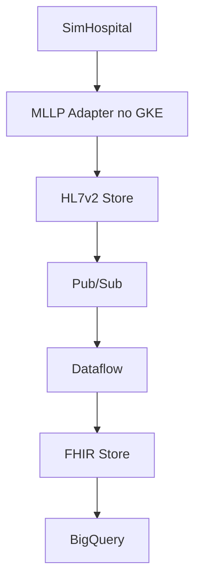

# Lab 02 — Streaming HL7 to FHIR Data with Healthcare API

## Objetivo

Construir um pipeline de interoperabilidade capaz de receber eventos HL7v2, transformá-los em recursos **FHIR** e disponibilizar esses dados para consulta analítica no **BigQuery**.

Este laboratório expande a ingestão básica de HL7v2 e demonstra uma arquitetura orientada a eventos, adequada para integração gradual entre sistemas hospitalares legados e plataformas clínicas modernas.

## Resultado alcançado

- APIs essenciais do Google Cloud habilitadas;
- dataset da Healthcare API e repositórios HL7v2/FHIR criados;
- Pub/Sub configurado para eventos de ingestão;
- IAM configurado para os serviços envolvidos;
- cluster GKE e workloads de integração implantados;
- MLLP Adapter e SimHospital em execução;
- pipeline Dataflow em estado **Running**;
- recursos `Patient` disponíveis no FHIR Store;
- tabela `Patient` consultada no BigQuery, com registros persistidos.

## Arquitetura implementada



## Serviços envolvidos

| Serviço | Responsabilidade |
|---|---|
| Cloud Healthcare API | Armazenar mensagens HL7v2 e recursos FHIR |
| Pub/Sub | Notificar a entrada de novas mensagens |
| Dataflow | Processar streaming e executar o mapeamento HL7v2 → FHIR |
| GKE | Executar MLLP Adapter e SimHospital como workloads em containers |
| BigQuery | Permitir consultas analíticas sobre recursos FHIR |
| IAM | Controlar acesso entre APIs e contas de serviço |
| Cloud Storage | Apoiar artefatos de mapeamento e configuração |

## Etapas executadas

### 1. Preparar o ambiente

Foram definidos projeto, localização, dataset, IDs dos repositórios, tópicos, assinatura, dataset do BigQuery e buckets de apoio.

Também foram habilitadas APIs de Compute, GKE, Dataflow, BigQuery, Pub/Sub e Healthcare API.

### 2. Criar a camada de mensageria e dados clínicos

Foram criados:

- tópico e assinatura Pub/Sub para eventos HL7;
- dataset do BigQuery;
- Healthcare dataset;
- HL7v2 Store;
- FHIR Store em R4.

Essa organização separa adequadamente a mensagem original, a camada de processamento e a representação clínica estruturada.

### 3. Configurar IAM

Contas de serviço e permissões foram configuradas para permitir que componentes gerenciados publicassem, consumissem, processassem e gravassem dados nos serviços necessários.

O ponto de atenção prático é que integrações em saúde exigem controle de identidade e acesso desde o início. Em produção, a política deve ser baseada em menor privilégio, contas de serviço dedicadas e auditoria.

### 4. Implantar o ambiente no GKE

O laboratório utilizou um cluster GKE para executar:

- **MLLP Adapter:** recebe e encaminha mensagens HL7v2;
- **SimHospital:** simula a origem dos eventos clínicos.

Os pods foram validados em estado `Running`, comprovando que a camada de entrada estava operacional.

### 5. Processar streaming com Dataflow

Um job de Dataflow foi iniciado para consumir os eventos do Pub/Sub, aplicar regras de conversão e escrever os resultados no FHIR Store e no BigQuery.

O estado `Running` do job confirmou que a camada de processamento contínuo estava ativa.

### 6. Validar recursos FHIR

O FHIR Viewer exibiu recursos do tipo `Patient`, demonstrando que dados provenientes da mensagem HL7v2 foram convertidos para uma estrutura clínica baseada em recursos.

### 7. Consultar no BigQuery

Exemplo de validação executada:

```bash
bq query --use_legacy_sql=false "
SELECT
  id,
  gender,
  birthDate,
  meta.lastUpdated
FROM \`$PROJECT_ID.$BQ_FHIR.Patient\`
LIMIT 10"
```

A consulta retornou registros de pacientes, comprovando a disponibilidade do dado para análise.

## O que foi aprendido na prática

### Interoperabilidade não é apenas transporte

HL7v2 resolve grande parte da troca tradicional de eventos, mas seu formato segmentado não é o modelo mais simples para consumo por APIs, aplicações web e dados analíticos. FHIR organiza informações em recursos padronizados e relacionáveis.

### Pub/Sub reduz acoplamento

O produtor não precisa conhecer todos os consumidores. Basta publicar o evento. Novos consumidores — analytics, alertas, auditoria ou automação — podem ser incluídos sem reescrever o sistema de origem.

### Dataflow materializa a camada de transformação

O pipeline executa continuamente a lógica que transforma mensagens em dados prontos para uso. Isso reduz rotinas manuais, permite escalabilidade e cria uma separação clara entre ingestão e consumo.

### BigQuery aproxima integração e decisão

Ao disponibilizar recursos FHIR em uma camada analítica, torna-se possível criar dashboards, indicadores operacionais, estudos de qualidade e insumos para modelos de machine learning.

## Aplicação no mundo real

Um hospital pode usar esse padrão para integrar gradualmente sistemas administrativos e assistenciais a uma plataforma moderna, sem substituir todos os legados de uma vez.

Exemplos de aplicação:

- centralização de eventos de admissão, alta e transferência;
- consolidação de cadastro clínico de pacientes;
- monitoramento de qualidade e completude de integrações;
- indicadores assistenciais e operacionais;
- preparação de dados para pesquisa, previsão ou automação;
- criação de APIs para aplicativos de jornada do paciente.

## Limites e cuidados de produção

Uma implementação real deve acrescentar:

- conformidade com LGPD e políticas institucionais;
- criptografia, auditoria e retenção de dados;
- validação de schema e regras de negócio;
- observabilidade fim a fim;
- gestão de versões dos mapeamentos;
- tratamento de reprocessamento, duplicidade e mensagens inválidas;
- desidentificação quando houver uso para pesquisa e análise.

## Evidências sugeridas

Consulte o [mapa de evidências](evidence.md) para associar os prints de GKE, Dataflow, FHIR Viewer e BigQuery a esta implementação.
