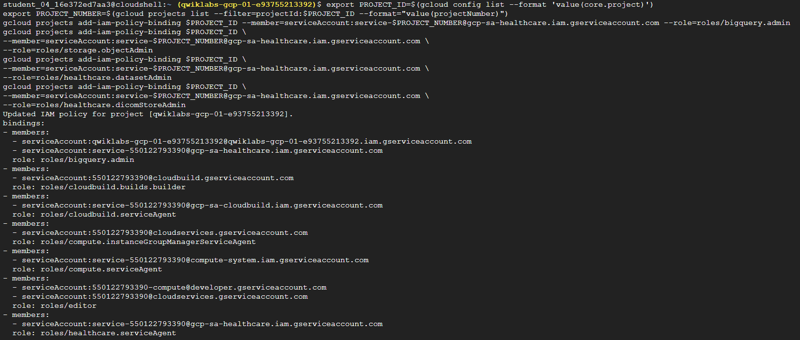
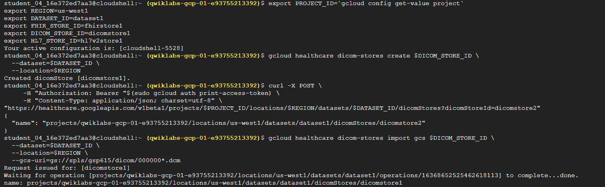
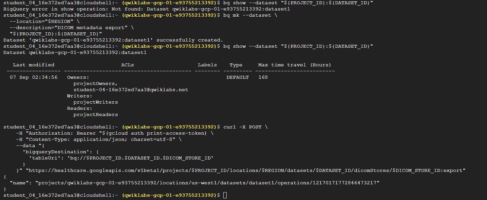
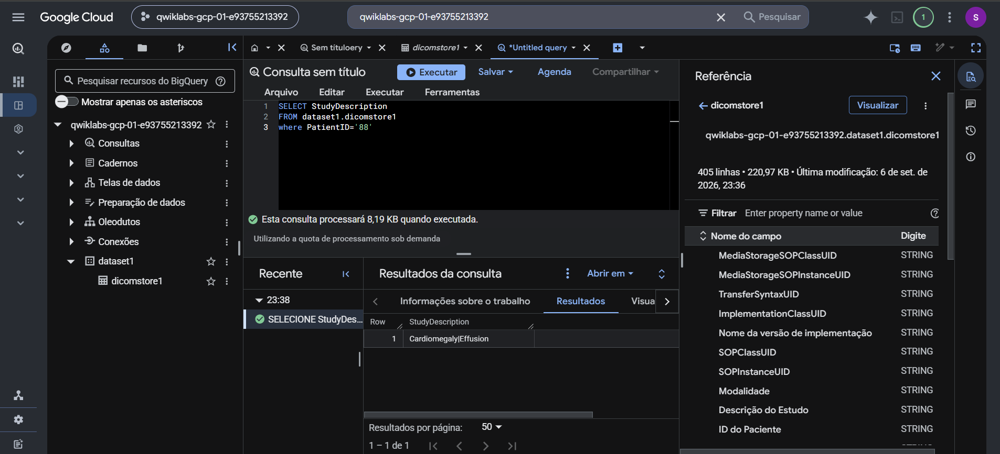
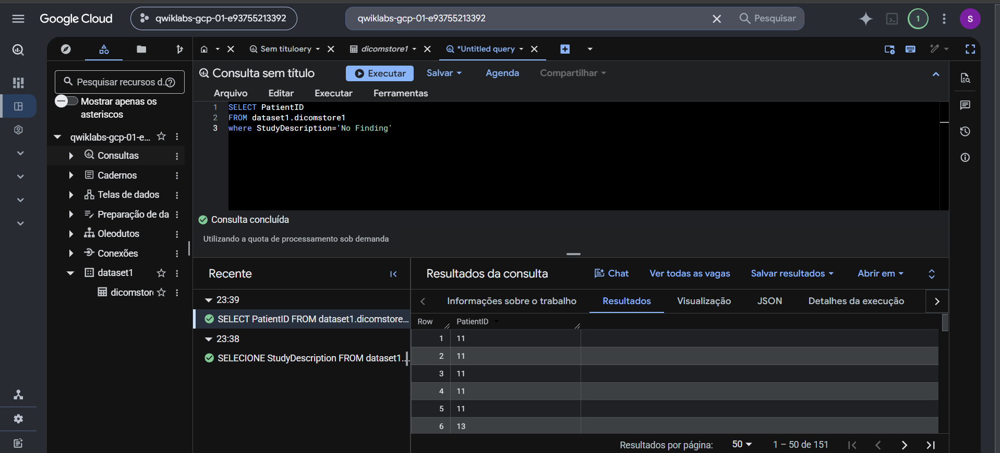
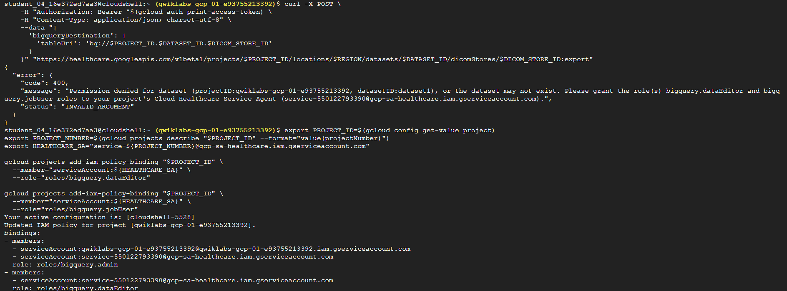

# Lab 03 — Ingesting DICOM Data with the Healthcare API

Laboratório prático de ingestão, armazenamento e análise de metadados DICOM com a **Google Cloud Healthcare API** e o **BigQuery**.

> Execução realizada em ambiente temporário de treinamento do Google Cloud. Foram utilizados dados públicos e sintéticos de radiografias de tórax; nenhum dado real de paciente está armazenado neste repositório.

## Objetivo

Implementar um fluxo de imagem médica de ponta a ponta: provisionar um DICOM Store, importar arquivos DICOM de um bucket do Cloud Storage, exportar seus metadados para o BigQuery e consultá-los com SQL.

## Cenário de negócio

Em uma integração PACS/RIS, os arquivos DICOM são necessários para visualização e diagnóstico, enquanto seus metadados permitem pesquisa operacional e análises sem acessar o conteúdo binário das imagens. Este lab simula essa separação:


## Arquitetura executada

| Componente | Papel no fluxo |
|---|---|
| Cloud Healthcare API | Plataforma gerenciada para armazenamento de dados de saúde |
| Dataset Healthcare | Contêiner lógico dos stores clínicos na região `us-west1` |
| DICOM Store | Repositório DICOM compatível com DICOMweb |
| Cloud Storage | Origem dos arquivos públicos `.dcm` |
| BigQuery | Destino dos metadados exportados e camada de consulta analítica |
| IAM / Service Agent | Autorizações do serviço para operar Healthcare API, Storage e BigQuery |

## Execução

### 1. Preparação e IAM

Foram identificados o projeto e o número do projeto, seguidos das permissões para o Cloud Healthcare Service Agent. As roles concedidas permitiram ao serviço administrar o dataset/DICOM Store e interagir com Storage e BigQuery.



### 2. Parametrização e criação dos DICOM Stores

O ambiente foi parametrizado com variáveis para projeto, região, dataset e identificadores dos stores. O `dicomstore1` foi criado com `gcloud`; um segundo store foi provisionado por API REST autenticada com `curl`.

```bash
gcloud healthcare dicom-stores create "$DICOM_STORE_ID" \
  --dataset="$DATASET_ID" \
  --location="$REGION"
```



### 3. Importação dos estudos DICOM

Arquivos DICOM públicos de radiografias de tórax foram importados de um bucket do Cloud Storage. A operação assíncrona retornou status `done`.

```bash
gcloud healthcare dicom-stores import gcs "$DICOM_STORE_ID" \
  --dataset="$DATASET_ID" \
  --location="$REGION" \
  --gcs-uri="gs://spls/gsp615/dicom/000000*.dcm"
```

### 4. Exportação de metadados ao BigQuery

Foi criado o dataset analítico e acionada a operação REST de exportação. A API retornou um identificador de operação assíncrona, confirmando o início da exportação.

```bash
bq mk --dataset \
  --location="$REGION" \
  --description="DICOM metadata export" \
  "${PROJECT_ID}:${DATASET_ID}"
```



### 5. Validação analítica com SQL

A tabela `dataset1.dicomstore1` foi consultada no BigQuery. O filtro pelo paciente sintético `88` retornou `Cardiomegaly|Effusion` em `StudyDescription`, comprovando que os metadados DICOM foram disponibilizados na camada analítica.

```sql
SELECT StudyDescription
FROM dataset1.dicomstore1
WHERE PatientID = '88';
```



Também foi executada uma segmentação por `StudyDescription = 'No Finding'`, que retornou 151 registros. Nesse conjunto, `No Finding` representa um estudo sem achado anormal registrado — não ausência de resultado clínico.

```sql
SELECT PatientID
FROM dataset1.dicomstore1
WHERE StudyDescription = 'No Finding';
```



## Troubleshooting: exportação recusada por IAM e destino inexistente

A primeira tentativa de exportação retornou `400 INVALID_ARGUMENT`. A mensagem da API indicava duas possíveis causas: permissões ausentes para o Cloud Healthcare Service Agent e inexistência do dataset BigQuery.

A correção foi aplicada em duas frentes:

1. concessão das roles `roles/bigquery.dataEditor` e `roles/bigquery.jobUser` ao service agent do projeto ativo;
2. criação e validação do dataset `dataset1` no BigQuery antes de repetir a exportação.



Esse cenário reforça uma dependência comum em integrações cloud: um endpoint correto não é suficiente; o serviço precisa de autorização explícita e o destino de dados deve existir na região esperada.

## Resultados comprovados

- DICOM Store criado e acessível pela Cloud Healthcare API;
- arquivos `.dcm` importados do Cloud Storage;
- segundo store criado por chamada REST autenticada;
- metadados DICOM exportados para o BigQuery;
- consultas SQL executadas sobre atributos dos estudos;
- falha de IAM/dataset diagnosticada a partir da resposta da API e corrigida.

## Competências praticadas

- Cloud Healthcare API e DICOM Store;
- DICOMweb e gerenciamento de imagens médicas;
- IAM e Cloud Healthcare Service Agent;
- `gcloud`, `curl` e autenticação Bearer;
- Cloud Storage e operações assíncronas;
- BigQuery, SQL e exploração de metadados clínicos;
- troubleshooting de integrações entre serviços gerenciados.

## Aplicação em ambientes de saúde

O padrão é aplicável a PACS/RIS integrados a plataformas de dados hospitalares. Ele permite manter a imagem no repositório DICOM e tornar seus metadados pesquisáveis para operação, auditoria, indicadores, qualidade de dados e análises de BI, preservando a necessidade de controles adequados de acesso e privacidade em cenários reais.
