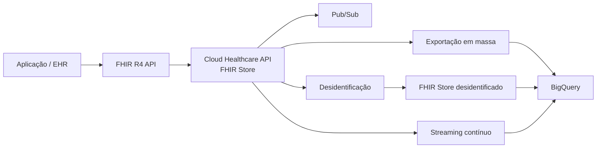
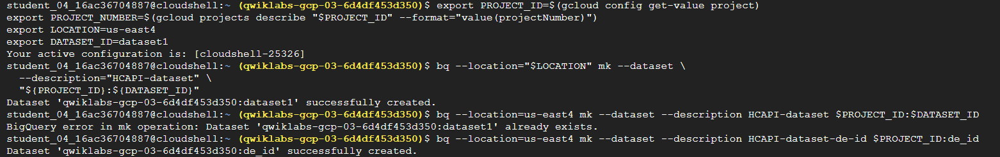
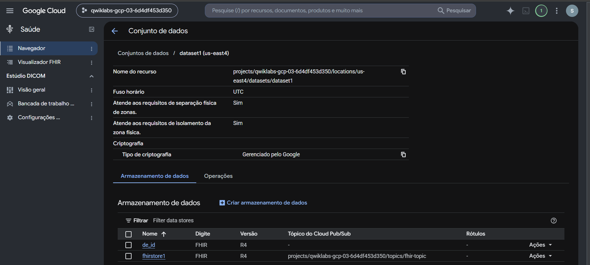
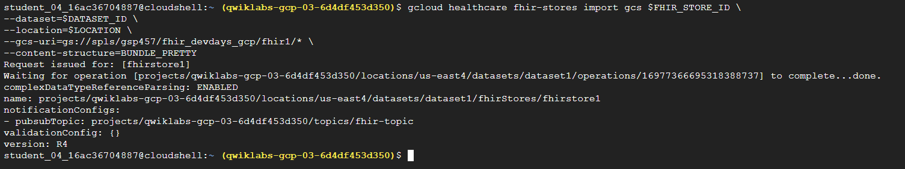
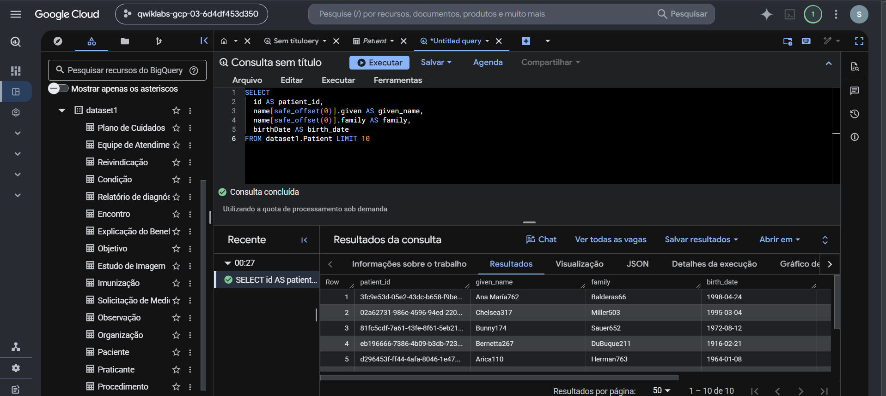
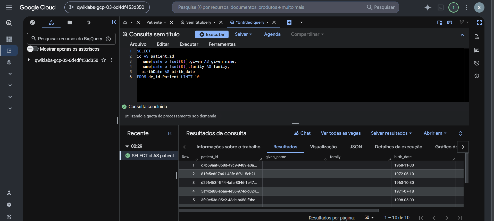
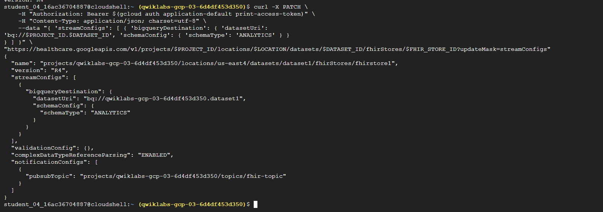
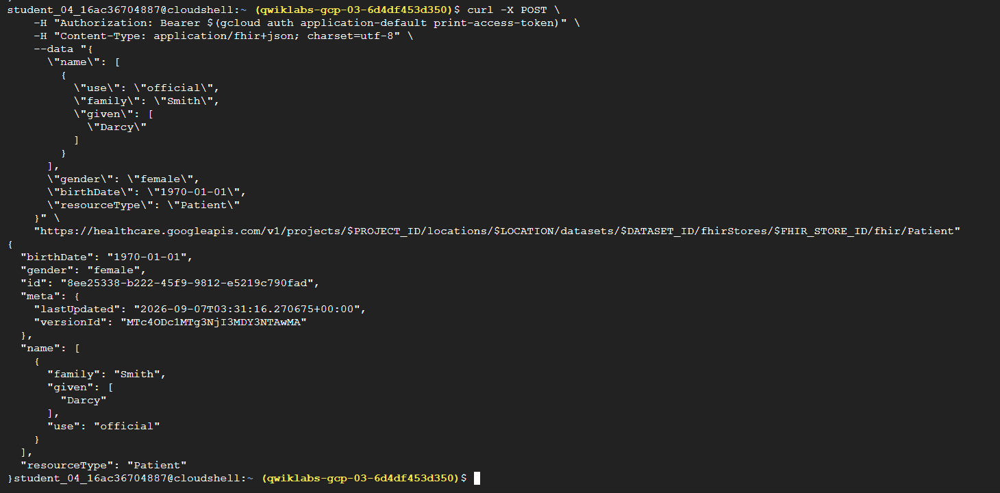
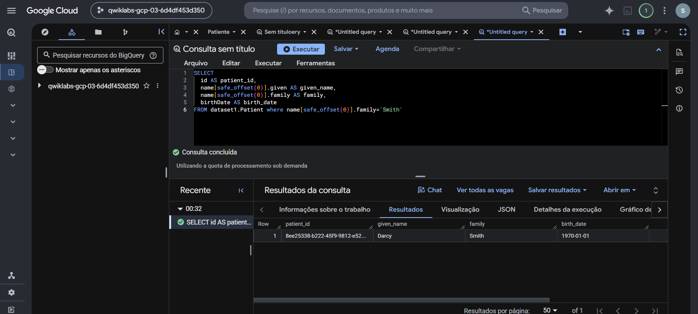

# Lab 04 — Ingesting FHIR Data with the Healthcare API

Laboratório prático de ingestão, armazenamento, desidentificação e exportação contínua de recursos **FHIR R4** com a Google Cloud Healthcare API e o BigQuery.

> Execução realizada em ambiente temporário de treinamento do Google Cloud, com recursos e dados de demonstração. Nenhum dado real de paciente está armazenado neste repositório.

## Objetivo

Demonstrar um ciclo completo de dados FHIR: criar os FHIR Stores, importar recursos de exemplo, exportá-los para análise, desidentificar os atributos pessoais e habilitar a propagação contínua de novas alterações para o BigQuery.

## Cenário de negócio

Um portal, app clínico ou integração moderna pode produzir recursos FHIR diretamente via API REST. A plataforma precisa persistir esses recursos, notificar outros consumidores, disponibilizar uma camada analítica e manter um caminho seguro para dados de pesquisa ou BI.



## Arquitetura executada

| Componente | Papel no fluxo |
|---|---|
| Healthcare Dataset | Contêiner lógico dos stores clínicos na região `us-east4` |
| `fhirstore1` | Store FHIR R4 principal, conectado ao tópico Pub/Sub |
| `de_id` | Store FHIR R4 de destino para os recursos desidentificados |
| Cloud Storage | Origem dos recursos FHIR de demonstração importados em massa |
| Pub/Sub | Notificações sobre alterações de recursos no store principal |
| BigQuery `dataset1` | Camada analítica para dados FHIR originais e streaming contínuo |
| BigQuery `de_id` | Camada analítica destinada aos recursos desidentificados |

## Execução

### 1. Contexto de projeto e datasets analíticos

O Cloud Shell foi alinhado ao projeto ativo do laboratório. Em seguida, foram criados os datasets `dataset1` e `de_id` no BigQuery, que se tornam os destinos analíticos do fluxo original e desidentificado.



### 2. FHIR Stores R4 e tópico Pub/Sub

No Healthcare Dataset `dataset1`, foram criados dois FHIR Stores em R4. O `fhirstore1` foi associado ao tópico `fhir-topic`, permitindo notificação de alterações de recursos.



### 3. Importação de recursos FHIR

Recursos FHIR de demonstração foram importados do Cloud Storage para o `fhirstore1` usando bundles formatados para importação.

```bash
gcloud healthcare fhir-stores import gcs "$FHIR_STORE_ID" \
  --dataset="$DATASET_ID" \
  --location="$LOCATION" \
  --gcs-uri="gs://spls/gsp457/fhir_devdays_gcp/fhir1/*" \
  --content-structure=BUNDLE_PRETTY
```



### 4. Exportação em massa e desidentificação

Os recursos do `fhirstore1` foram exportados ao BigQuery com esquema analítico. Em seguida, o recurso de desidentificação do Cloud Healthcare API criou uma cópia no `de_id`, removendo ou transformando atributos pessoais antes de uma nova exportação para a camada analítica separada.

```bash
gcloud healthcare fhir-stores export bq "$FHIR_STORE_ID" \
  --dataset="$DATASET_ID" \
  --location="$LOCATION" \
  --bq-dataset="bq://${PROJECT_ID}.${DATASET_ID}" \
  --schema-type=analytics
```

## Validação: original versus desidentificado

No BigQuery, a consulta ao `dataset1.Patient` retornou os campos de nome e data de nascimento dos dados de demonstração.

```sql
SELECT
  id AS patient_id,
  name[SAFE_OFFSET(0)].given AS given_name,
  name[SAFE_OFFSET(0)].family AS family,
  birthDate AS birth_date
FROM dataset1.Patient
LIMIT 10;
```



A mesma consulta sobre `de_id.Patient` retornou o identificador técnico, mas os campos de nome e sobrenome foram suprimidos e as datas de nascimento alteradas. Isso valida o isolamento de atributos pessoais na versão desidentificada.

```sql
SELECT
  id AS patient_id,
  name[SAFE_OFFSET(0)].given AS given_name,
  name[SAFE_OFFSET(0)].family AS family,
  birthDate AS birth_date
FROM de_id.Patient
LIMIT 10;
```



## Streaming contínuo FHIR → BigQuery

Primeiro, foi confirmada a ausência de um paciente de demonstração com sobrenome `Smith` no BigQuery. Depois, o FHIR Store recebeu uma configuração `streamConfigs` por `PATCH`, apontando para o dataset analítico com esquema `ANALYTICS`.



Um novo recurso `Patient` foi criado por `POST` na API FHIR. A resposta retornou o recurso persistido, incluindo o `id` atribuído pelo servidor.

```http
POST .../fhir/Patient
Content-Type: application/fhir+json
```



Por fim, a consulta no BigQuery retornou o novo paciente, comprovando a exportação contínua após a alteração no FHIR Store.



## Resultados comprovados

- Healthcare Dataset e dois FHIR Stores R4 provisionados;
- recursos FHIR importados do Cloud Storage;
- notificações configuradas com Pub/Sub;
- exportação em massa dos recursos FHIR para BigQuery;
- recursos desidentificados em um FHIR Store separado;
- comparação SQL entre dados originais e desidentificados;
- recurso `Patient` criado por API REST;
- exportação contínua FHIR → BigQuery validada por consulta SQL.

## Competências praticadas

- FHIR R4 e recursos `Patient`;
- Cloud Healthcare API e FHIR Store;
- importação/exportação em massa de dados clínicos;
- BigQuery e schema analítico de FHIR;
- Pub/Sub e propagação de eventos;
- API REST, `PATCH`, `POST`, `curl` e autenticação Bearer;
- desidentificação e governança de dados para analytics;
- validação de integrações por consultas SQL.

## Aplicação em ambientes de saúde

O padrão permite que aplicações clínicas e portais interoperem por recursos FHIR enquanto dados operacionais e analíticos são atualizados sem processos manuais de ETL. A separação entre store original e store desidentificado é especialmente relevante para BI, pesquisa, validação de modelos e compartilhamento controlado de informações, sempre complementada por controles de acesso, LGPD e políticas de governança apropriadas.
