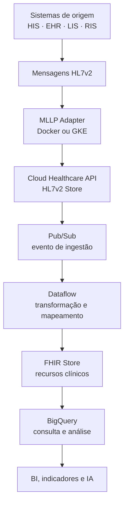

# Arquitetura de interoperabilidade

## Visão geral

A arquitetura documentada neste repositório demonstra como integrar dados clínicos provenientes de sistemas hospitalares tradicionais a uma plataforma cloud orientada a padrões.

O ponto de partida é o **HL7v2**, formato ainda muito presente em HIS, LIS, RIS e sistemas de prontuário. O destino é o **FHIR**, padrão baseado em recursos e APIs REST, mais adequado para integrações modernas, aplicações digitais e consumo analítico.

## Componentes e responsabilidades

| Componente | Papel na solução | Benefício operacional |
|---|---|---|
| HIS/EHR/LIS/RIS | Gera eventos e mensagens clínicas | Preserva os sistemas legados existentes |
| MLLP | Protocolo de transporte de mensagens HL7v2 | Integra sistemas que não possuem API REST moderna |
| MLLP Adapter | Recebe a mensagem e a encaminha à Healthcare API | Isola a conectividade da lógica clínica |
| HL7v2 Store | Armazena mensagens HL7v2 | Centraliza a ingestão e permite consulta/auditoria |
| Pub/Sub | Publica notificações de novas mensagens | Desacopla a ingestão dos consumidores posteriores |
| Dataflow | Processa streaming e aplica mapeamentos | Escala o processamento sem operação manual de servidores |
| FHIR Store | Armazena recursos clínicos estruturados | Expõe dados com um padrão de interoperabilidade moderno |
| BigQuery | Permite análise de dados estruturados | Acelera BI, indicadores e exploração de dados |

## Fluxo lógico

1. Um sistema clínico gera uma mensagem HL7v2, por exemplo uma admissão, atualização cadastral ou resultado.
2. A mensagem é enviada por MLLP ao adaptador.
3. O adaptador valida o transporte e envia o payload para o HL7v2 Store.
4. A chegada de uma mensagem gera uma notificação no Pub/Sub.
5. Um pipeline de Dataflow consome o evento, interpreta os segmentos HL7v2 e mapeia seus dados.
6. O resultado é persistido como recursos FHIR, como `Patient`, `Encounter` ou `Observation`.
7. A camada analítica consulta dados no BigQuery para dashboards, auditoria ou aplicações de IA.

## Da demonstração ao ambiente produtivo

No laboratório, o adaptador foi executado localmente em Docker para validar o fluxo. Em produção, a recomendação é executá-lo como aplicação **stateless** no Google Kubernetes Engine (GKE), com:

- múltiplas réplicas do adaptador;
- balanceamento interno;
- políticas de IAM de menor privilégio;
- observabilidade de logs, métricas e falhas;
- segmentação de rede e comunicação privada;
- monitoramento de latência, erros de parsing e volume de mensagens.

## Por que esse desenho importa em saúde

Hospitais raramente possuem um único sistema. A informação transita entre atendimento, laboratório, imagem, faturamento, prescrição e sistemas de apoio. Uma arquitetura orientada a eventos e padrões reduz acoplamento, facilita evolução gradual e melhora a disponibilidade das integrações.

O modelo não substitui automaticamente os sistemas assistenciais existentes. Ele cria uma camada de interoperabilidade para que dados clínicos possam circular com mais consistência, rastreabilidade e capacidade de uso.
