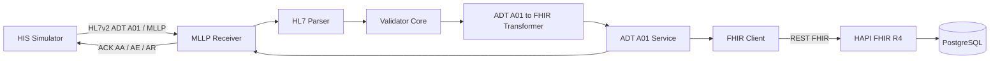

# Arquitetura v0.1 — Healthcare Integration Gateway

## 1. Objetivo

O **Healthcare Integration Gateway** é uma implementação prática e modular para receber, interpretar, validar, transformar e persistir dados de interoperabilidade em saúde.

A arquitetura foi construída incrementalmente para servir como laboratório técnico, portfólio de engenharia e base evolutiva para PoC, MVP, piloto e produto.

## 2. Estado atual

Até o Milestone 1.5, o primeiro fluxo funcional está conectado e validado ponta a ponta.



### Componentes implementados

| Componente | Status | Responsabilidade |
|---|---|---|
| HIS Simulator | ✅ | gerar e enviar mensagens sintéticas |
| MLLP Receiver | ✅ | TCP/MLLP, framing, recepção e ACK |
| HL7 Parser | ✅ | converter HL7 bruto em representação interna |
| Validator Core | ✅ | validar tipo, segmentos e campos mínimos |
| ADT^A01 Transformer | ✅ | mapear HL7v2 para FHIR R4 |
| ADT A01 Service | ✅ | orquestrar transformação e persistência |
| FHIR Client | ✅ | comunicação REST com HAPI FHIR |
| HAPI FHIR R4 | ✅ | servidor FHIR local |
| PostgreSQL | ✅ | persistência do HAPI FHIR |
| Testes automatizados | ✅ | regressão do core e transformer |
| Audit/logs estruturados | 🔜 | próximo estágio |
| Idempotência/duplicidade | 🔜 | próximo estágio |

## 3. Separação de responsabilidades

A arquitetura evita concentrar transporte, parsing, transformação e persistência em um único componente.

```text
Transport
  MLLP Receiver
       |
Core
  HL7 Parser
       |
  Validator
       |
Transformation
  ADT^A01 -> FHIR
       |
Application
  ADT A01 Service
       |
Outbound
  FHIR Client
       |
Destination
  HAPI FHIR -> PostgreSQL
```

Esse desenho reduz acoplamento e facilita testes, manutenção e substituição de componentes.

## 4. Fluxo de sucesso

1. HIS Simulator abre conexão TCP com o Receiver.
2. A mensagem `ADT^A01` é enviada com framing MLLP.
3. O Receiver extrai o payload.
4. O Parser produz `ParsedHL7Message`.
5. O Validator verifica tipo, segmentos e campos obrigatórios.
6. O Transformer cria o `Patient`.
7. O FHIR Client executa `POST Patient`.
8. O service captura o ID retornado.
9. O Transformer cria o `Encounter` apontando para `Patient/{id}`.
10. O FHIR Client executa `POST Encounter`.
11. HAPI FHIR persiste os resources no PostgreSQL.
12. O gateway retorna `ACK AA` ao emissor.

## 5. Fluxo de erro

Mensagens inválidas continuam usando a matriz:

```text
AA = Application Accept
AE = Application Error
AR = Application Reject
```

No estado atual:

- tipo não suportado → `AR`;
- falha de validação → `AE`;
- falha durante persistência FHIR → `AE`;
- processamento e persistência concluídos → `AA`.

## 6. Rastreabilidade

O `MSH-10 Message Control ID` é utilizado como correlation id.

Nos resources FHIR gerados:

```text
meta.source = urn:hl7v2:message:{MSH-10}
```

Exemplo:

```text
urn:hl7v2:message:MSG00001
```

## 7. Persistência e relacionamento

O `Patient` é persistido primeiro.

O ID retornado pelo HAPI FHIR é usado para construir:

```text
Encounter.subject.reference = Patient/{id}
```

Na execução de validação do Milestone 1.5:

```text
Patient/1057
Encounter/1058
Encounter.subject.reference = Patient/1057
```

## 8. Estado da validação

```text
✅ Docker / Docker Compose
✅ PostgreSQL healthy
✅ HAPI FHIR /metadata
✅ HL7v2 ADT^A01
✅ TCP / MLLP
✅ ACK AA / AE / AR
✅ Parser desacoplado
✅ Validator Core
✅ Patient mapping
✅ Encounter mapping
✅ FHIR Client
✅ persistência Patient
✅ captura de Patient ID
✅ persistência Encounter
✅ vínculo Patient / Encounter
✅ 8 testes automatizados
✅ fluxo MLLP -> FHIR -> ACK end-to-end
```

## 9. Limitações conhecidas

- reenvio do mesmo ADT ainda pode criar duplicidades;
- não existe idempotency key persistida;
- FHIR Client e service ainda precisam de testes específicos com mocks/falhas;
- segmentos HL7 repetidos ainda não são preservados como coleção;
- timezone não é inventado quando ausente na mensagem de origem;
- logs existem, mas auditoria estruturada ainda não possui persistência dedicada;
- autenticação enterprise e alta disponibilidade estão fora do escopo atual.

## 10. Próximo milestone

**Milestone 1.6 — End-to-end hardening e confiabilidade**

O foco será evoluir o pipeline que já funciona para um comportamento operacional mais robusto:

- idempotência;
- duplicate detection;
- error handling;
- retry policy;
- data quality e validações adicionais;
- auditoria estruturada;
- testes do outbound FHIR;
- preparação para novos fluxos HL7.

## 11. Princípio arquitetural

A regra permanece:

**cada componente deve conhecer apenas o necessário para cumprir sua responsabilidade.**

Isso permite evoluir o gateway para novas mensagens, transportes e destinos sem reescrever o pipeline inteiro.
