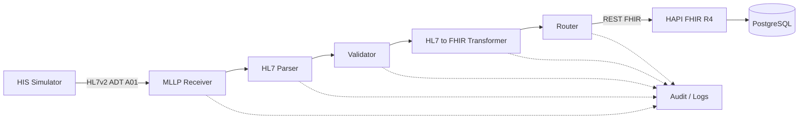

# Arquitetura v0.1 — Healthcare Integration Gateway

## 1. Objetivo deste documento

Este documento descreve a arquitetura inicial do **Healthcare Integration Gateway**, a evolução prática do repositório `healthcare-interoperability-labs` para uma solução modular de interoperabilidade em saúde.

A arquitetura v0.1 foi definida para atender a três objetivos simultâneos:

1. **Aprendizado técnico:** permitir compreensão teórica e prática de cada componente.
2. **Portfólio profissional:** demonstrar capacidade de projetar, implementar, testar e sustentar integrações em saúde.
3. **Evolução para produto:** evitar uma implementação descartável e criar uma base que possa evoluir para PoC, MVP, piloto e produto.

---

## 2. Problema arquitetural

Ambientes de saúde normalmente possuem múltiplos sistemas especializados, como HIS, LIS, RIS, PACS, ERP, aplicações web, APIs e plataformas analíticas.

Esses sistemas podem utilizar tecnologias e padrões diferentes.

Exemplos:

- HL7v2
- MLLP
- FHIR
- REST
- JSON
- XML
- DICOM / DICOMweb
- integrações diretas com banco de dados

Quando dois sistemas não possuem uma interface compatível, surge a necessidade de uma camada de integração capaz de interpretar, validar, transformar e entregar a informação.

O gateway será essa camada intermediária.

```text
Sistema de origem
       |
       v
Healthcare Integration Gateway
       |
       v
Sistema de destino
```

---

## 3. Arquitetura lógica v0.1



### Fluxo principal

```text
HIS Simulator
    |
    | HL7v2 ADT^A01
    v
MLLP Receiver
    |
    v
Parser
    |
    v
Validator
    |
    v
Transformer
    |
    | Patient + Encounter
    v
Router
    |
    | HTTP / FHIR REST API
    v
HAPI FHIR
    |
    v
PostgreSQL
```

---

## 4. Responsabilidade de cada componente

### 4.1 HIS Simulator

Representa um sistema hospitalar de origem.

Nesta fase não utilizaremos um HIS real. O simulador será responsável por gerar mensagens HL7v2 sintéticas e enviá-las ao gateway.

Responsabilidades:

- gerar mensagens de teste;
- simular eventos de admissão;
- iniciar conexões MLLP;
- enviar ADT^A01;
- receber e interpretar ACKs.

Por que ele existe:

Permite testar a plataforma de forma reproduzível sem depender de software hospitalar proprietário.

---

### 4.2 MLLP Receiver

É a porta de entrada inicial do gateway.

Responsabilidades:

- abrir uma porta TCP;
- aceitar conexões;
- reconhecer o framing MLLP;
- extrair a mensagem HL7v2;
- encaminhar a mensagem ao pipeline;
- devolver ACK/NACK conforme o resultado.

Importante:

**HL7v2 define a estrutura da mensagem; MLLP é uma forma de transportar essa mensagem por TCP.**

---

### 4.3 HL7 Parser

Transforma a mensagem textual HL7v2 em uma estrutura que a aplicação consiga manipular.

Exemplo de entrada:

```text
PID|1||123456^^^HOSPITAL^MR||SILVA^JOAO||19850315|M
```

O parser deverá permitir acessar elementos como:

- PID-3: identificador do paciente;
- PID-5: nome;
- PID-7: data de nascimento;
- PID-8: sexo administrativo.

O parser não deverá assumir responsabilidade de negócio ou de transporte.

---

### 4.4 Validator

Verifica se a mensagem pode continuar no pipeline.

Tipos de validação previstos:

#### Estrutural

- mensagem possui MSH;
- evento suportado;
- segmentos mínimos esperados;
- campos essenciais presentes.

#### Regra da integração

Exemplos futuros:

- identificador do paciente obrigatório;
- código da unidade válido;
- evento habilitado para aquele cliente;
- mensagem não duplicada.

O objetivo é impedir que mensagens inválidas sejam convertidas ou entregues como se fossem corretas.

---

### 4.5 Transformer

Converte o modelo de origem para o modelo de destino.

No MVP v0.1:

```text
HL7v2 ADT^A01
       |
       +--> PID --> FHIR Patient
       |
       +--> PV1 --> FHIR Encounter
```

O transformer deverá ser separado do receiver para permitir reutilização futura com outras formas de entrada.

---

### 4.6 Router

Decide para onde os dados processados deverão ser enviados.

Na v0.1 haverá apenas um destino principal:

```text
HAPI FHIR R4
```

No futuro, o mesmo componente poderá suportar:

- múltiplos FHIR Servers;
- APIs REST externas;
- filas;
- webhooks;
- data lakes;
- outros sistemas hospitalares.

---

### 4.7 HAPI FHIR

Será utilizado como servidor FHIR local de desenvolvimento.

Responsabilidades no laboratório:

- expor a API REST FHIR;
- receber recursos FHIR R4;
- validar operações básicas do protocolo;
- permitir consultas aos recursos persistidos;
- servir como destino da integração.

No MVP inicial trabalharemos principalmente com:

- Patient;
- Encounter.

---

### 4.8 PostgreSQL

Será a camada de persistência do HAPI FHIR no ambiente local.

Sua inclusão ajuda a reproduzir uma arquitetura mais próxima de uma solução real e permite estudar:

- persistência;
- volumes Docker;
- recuperação após reinício;
- separação entre aplicação e banco.

O gateway poderá ter sua própria persistência de auditoria em etapa posterior.

---

### 4.9 Audit / Logs

Observabilidade não será tratada como detalhe opcional.

Cada mensagem deverá, progressivamente, produzir informações de rastreabilidade, como:

```text
message_id
client_id
message_type
received_at
processed_at
status
processing_time
destination
response_code
error
retry_count
```

Na primeira versão isso poderá ser implementado com logs estruturados. Posteriormente poderá evoluir para banco, métricas e dashboards.

---

## 5. Princípio de baixo acoplamento

A principal regra arquitetural é evitar que um componente conheça detalhes desnecessários de outro.

Exemplo incorreto:

```text
MLLP Receiver + Parsing + Mapping + HTTP FHIR
```

Tudo implementado em um único bloco.

Problema:

- difícil de testar;
- difícil de manter;
- difícil de substituir;
- difícil de reutilizar;
- aumenta risco de mudanças colaterais.

Estrutura desejada:

```text
Receiver
   |
Parser
   |
Validator
   |
Transformer
   |
Router
```

Assim, no futuro, uma nova entrada REST poderá reutilizar validação, transformação e roteamento sem depender do MLLP.

---

## 6. Princípio de configuração por cliente

O produto deverá evitar regras específicas codificadas diretamente no core.

Exemplo conceitual:

```yaml
client:
  id: hospital_demo

input:
  protocol: mllp
  port: 2575

hl7:
  version: "2.5"
  accepted_messages:
    - ADT_A01

output:
  type: fhir
  version: R4

mapping:
  ADT_A01: adt_a01_to_patient_encounter
```

A implementação multi-cliente não será feita de uma vez, mas as decisões atuais devem evitar impedir essa evolução.

---

## 7. Escopo técnico da v0.1

### Incluído

- ambiente local;
- Docker / Docker Compose;
- PostgreSQL;
- HAPI FHIR R4;
- HIS Simulator;
- transporte MLLP;
- HL7v2 ADT^A01;
- parsing de MSH, EVN, PID e PV1;
- validação mínima;
- transformação para Patient e Encounter;
- envio via REST FHIR;
- ACK/NACK;
- logs;
- testes;
- documentação;
- dados sintéticos.

### Fora do escopo inicial

- produção;
- dados reais de pacientes;
- autenticação enterprise;
- alta disponibilidade;
- DICOM operacional;
- ORM/ORU;
- Kafka/RabbitMQ;
- dashboard;
- IA;
- multi-tenancy completo;
- deploy cloud produtivo.

Esses itens poderão entrar em versões futuras após validação do core.

---

## 8. Estrutura prevista do repositório

```text
healthcare-interoperability-labs/
|
+-- docs/
|   +-- architecture/
|   +-- fundamentals/
|   +-- implementation/
|   +-- testing/
|   +-- troubleshooting/
|
+-- platform/
|   +-- receivers/
|   +-- parser/
|   +-- validator/
|   +-- transformer/
|   +-- router/
|   +-- audit/
|
+-- config/
|   +-- clients/
|
+-- samples/
|   +-- hl7/
|   +-- fhir/
|
+-- tests/
|
+-- docker/
|
+-- evidence/
```

As pastas serão criadas conforme forem necessárias. Não serão adicionadas estruturas vazias sem finalidade prática.

---

## 9. Estratégia de validação

Cada componente será validado isoladamente antes da integração completa.

```text
HAPI FHIR funcionando
        |
        v
FHIR REST validado
        |
        v
Mensagem ADT válida
        |
        v
Parser validado
        |
        v
Validator validado
        |
        v
Transformer validado
        |
        v
MLLP validado
        |
        v
Fluxo end-to-end
```

Isso permite localizar falhas com mais precisão.

---

## 10. Critério de sucesso da v0.1

A arquitetura será considerada funcional quando conseguirmos demonstrar, de forma reproduzível:

1. o HIS Simulator envia uma ADT^A01 sintética;
2. o gateway recebe a mensagem por MLLP;
3. a mensagem é identificada e interpretada;
4. os campos mínimos são validados;
5. PID é transformado em Patient;
6. PV1 é transformado em Encounter;
7. os recursos são enviados ao HAPI FHIR;
8. Patient e Encounter podem ser consultados pela API FHIR;
9. o emissor recebe um ACK coerente;
10. a operação fica registrada em logs/auditoria;
11. todo o processo possui documentação e evidências no repositório.

---

## 11. Próximo documento

O fluxo detalhado do primeiro caso de uso está documentado em:

[`02-adt-a01-flow.md`](02-adt-a01-flow.md)
