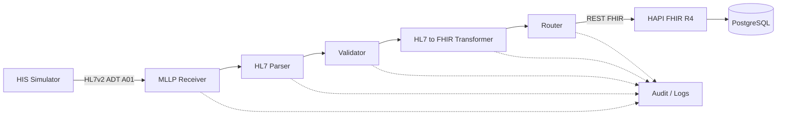

# Arquitetura v0.1 — Healthcare Integration Gateway

## 1. Objetivo deste documento

Este documento descreve a arquitetura inicial do **Healthcare Integration Gateway**, a evolução prática do repositório `healthcare-interoperability-labs` para uma solução modular de interoperabilidade em saúde.

A arquitetura v0.1 foi definida para atender a três objetivos simultâneos:

1. **Aprendizado técnico:** permitir compreensão teórica e prática de cada componente.
2. **Portfólio profissional:** demonstrar capacidade de projetar, implementar, testar e sustentar integrações em saúde.
3. **Evolução para produto:** evitar uma implementação descartável e criar uma base que possa evoluir para PoC, MVP, piloto e produto.

---

## 2. Problema arquitetural

Ambientes de saúde normalmente possuem múltiplos sistemas especializados, como HIS, LIS, RIS, PACS, ERP, aplicações web, APIs e plataformas analíticas.

Esses sistemas podem utilizar tecnologias e padrões diferentes.

Exemplos:

- HL7v2;
- MLLP;
- FHIR;
- REST;
- JSON;
- XML;
- DICOM / DICOMweb;
- integrações diretas com banco de dados.

Quando dois sistemas não possuem uma interface compatível, surge a necessidade de uma camada de integração capaz de interpretar, validar, transformar e entregar a informação.

O gateway será essa camada intermediária.

```text
Sistema de origem
       |
       v
Healthcare Integration Gateway
       |
       v
Sistema de destino
```

---

## 3. Estado atual da arquitetura

A arquitetura alvo do MVP v0.1 é maior do que o que já está implementado. Para evitar confusão entre **desenho arquitetural** e **software concluído**, este documento usa três estados:

- ✅ **Implementado e validado** — componente já construído e testado;
- 🔜 **Próximo milestone** — componente seguinte da evolução;
- ⏳ **Planejado** — componente previsto na arquitetura, ainda não implementado.

### 3.1 Arquitetura alvo do MVP v0.1



### 3.2 O que já está implementado

```text
✅ HIS Simulator / mensagem ADT^A01 sintética
        |
        +--> ✅ Inspector HL7
        |
        `--> ✅ Structural Validator
                 |
                 +--> PASS
                 `--> FAIL

✅ HAPI FHIR R4
        |
        | JDBC
        v
✅ PostgreSQL
        |
        v
✅ Docker Volume
```

Os dois blocos acima ainda não estão conectados ponta a ponta.

### 3.3 Próximo milestone

```text
✅ HIS Simulator
        |
        | HL7v2 ADT^A01 / MLLP
        v
🔜 MLLP Receiver
        |
        +--> ACK / NACK
        |
        v
⏳ Parser desacoplado
        |
        v
⏳ Validator Core
```

### 3.4 Componentes planejados depois do MLLP

```text
⏳ HL7 Parser
      |
      v
⏳ Validator Core
      |
      v
⏳ HL7 -> FHIR Transformer
      |
      v
⏳ Router
      |
      | REST FHIR
      v
✅ HAPI FHIR R4
      |
      v
✅ PostgreSQL
```

---

## 4. Responsabilidade de cada componente

### 4.1 HIS Simulator — ✅ implementado parcialmente

Representa um sistema hospitalar de origem.

Nesta fase não utilizamos um HIS real. O simulador utiliza mensagens HL7v2 sintéticas para reproduzir eventos hospitalares.

Já implementado:

- mensagem `ADT^A01` sintética;
- segmentos `MSH`, `EVN`, `PID` e `PV1`;
- inspeção de campos;
- validação estrutural mínima.

Responsabilidades futuras do simulador:

- iniciar conexões MLLP;
- enviar `ADT^A01`;
- receber e interpretar ACKs.

Por que ele existe:

Permite testar a plataforma de forma reproduzível sem depender de software hospitalar proprietário.

---

### 4.2 MLLP Receiver — 🔜 próximo milestone

Será a porta de entrada inicial do gateway para HL7v2.

Responsabilidades previstas:

- abrir uma porta TCP;
- aceitar conexões;
- reconhecer o framing MLLP;
- extrair a mensagem HL7v2;
- encaminhar a mensagem ao pipeline;
- devolver ACK/NACK conforme o resultado.

Importante:

**HL7v2 define a estrutura e a semântica da mensagem; MLLP é uma forma de transportar essa mensagem por TCP.**

---

### 4.3 HL7 Parser — ⏳ planejado como componente independente

Transformará a mensagem textual HL7v2 em uma estrutura manipulável pela aplicação.

No Milestone 1.2 já foi criado um utilitário de inspeção capaz de interpretar os campos básicos da mensagem. Esse utilitário serve como aprendizado e validação inicial, mas ainda não representa o parser definitivo do gateway.

Exemplo de entrada:

```text
PID|1||123456^^^HOSPITAL^MR||SILVA^JOAO||19850315|M
```

O parser deverá permitir acessar elementos como:

- `PID-3`: identificador do paciente;
- `PID-5`: nome;
- `PID-7`: data de nascimento;
- `PID-8`: sexo administrativo.

O parser não deverá assumir responsabilidade de negócio, transporte ou roteamento.

---

### 4.4 Validator — ✅ versão estrutural inicial / ⏳ core futuro

Já existe um validador estrutural mínimo para `ADT^A01`.

Validações atualmente implementadas:

- presença de `MSH`, `EVN`, `PID` e `PV1`;
- `MSH-9 = ADT^A01`;
- `MSH-10` preenchido;
- `MSH-12` preenchido;
- `PID-3` preenchido;
- `PID-5` preenchido;
- `PV1-2` preenchido;
- `PV1-19` preenchido;
- `PV1-44` preenchido.

O Validator Core futuro deverá evoluir para dois níveis:

#### Estrutural

- segmentos mínimos esperados;
- tipo de mensagem suportado;
- campos obrigatórios;
- versão HL7 suportada.

#### Regra da integração

Exemplos futuros:

- identificador do paciente obrigatório;
- código de unidade válido;
- evento habilitado para determinado cliente;
- mensagem não duplicada;
- compatibilidade com configuração do destino.

O objetivo é impedir que mensagens inválidas sejam convertidas ou entregues como se fossem corretas.

---

### 4.5 Transformer — ⏳ planejado

Converterá o modelo de origem para o modelo de destino.

No MVP v0.1:

```text
HL7v2 ADT^A01
       |
       +--> PID --> FHIR Patient
       |
       `--> PV1 --> FHIR Encounter
```

A separação do Transformer permitirá reutilização futura com outras formas de entrada.

---

### 4.6 Router — ⏳ planejado

Decidirá para onde os dados processados deverão ser enviados.

Na v0.1 haverá um destino principal:

```text
HAPI FHIR R4
```

No futuro poderá suportar:

- múltiplos FHIR Servers;
- APIs REST externas;
- filas;
- webhooks;
- data lakes;
- outros sistemas hospitalares.

---

### 4.7 HAPI FHIR — ✅ implementado e validado

É utilizado como servidor FHIR local de desenvolvimento.

Já validado:

- API REST FHIR;
- `CapabilityStatement`;
- criação de `Patient`;
- consulta por identificador;
- persistência após recriação dos containers.

No MVP inicial os principais recursos previstos são:

- `Patient`;
- `Encounter`.

---

### 4.8 PostgreSQL — ✅ implementado e validado

É a camada de persistência do HAPI FHIR no ambiente local.

O laboratório já validou:

- conexão HAPI FHIR -> PostgreSQL;
- persistência em volume Docker;
- recuperação após reinício.

O gateway poderá ter sua própria persistência de auditoria em etapa posterior.

---

### 4.9 Audit / Logs — ⏳ planejado

Observabilidade não será tratada como detalhe opcional.

Cada mensagem deverá progressivamente produzir informações de rastreabilidade, como:

```text
message_id
client_id
message_type
received_at
processed_at
status
processing_time
destination
response_code
error
retry_count
```

Na primeira versão isso poderá ser implementado com logs estruturados e posteriormente evoluir para persistência, métricas e dashboards.

---

## 5. Princípio de baixo acoplamento

A principal regra arquitetural é evitar que um componente conheça detalhes desnecessários de outro.

Exemplo incorreto:

```text
MLLP Receiver + Parsing + Mapping + HTTP FHIR
```

Tudo implementado em um único bloco.

Problemas:

- difícil de testar;
- difícil de manter;
- difícil de substituir;
- difícil de reutilizar;
- maior risco de mudanças colaterais.

Estrutura desejada:

```text
Receiver
   |
Parser
   |
Validator
   |
Transformer
   |
Router
```

Assim, no futuro, uma nova entrada REST poderá reutilizar validação, transformação e roteamento sem depender do MLLP.

---

## 6. Princípio de configuração por cliente

O produto deverá evitar regras específicas codificadas diretamente no core.

Exemplo conceitual:

```yaml
client:
  id: hospital_demo

input:
  protocol: mllp
  port: 2575

hl7:
  version: "2.5"
  accepted_messages:
    - ADT_A01

output:
  type: fhir
  version: R4

mapping:
  ADT_A01: adt_a01_to_patient_encounter
```

A implementação multi-cliente não será feita de uma vez, mas as decisões atuais devem evitar bloquear essa evolução.

---

## 7. Escopo técnico da v0.1

### Já implementado / validado

- ambiente local;
- Docker / Docker Compose;
- PostgreSQL;
- HAPI FHIR R4;
- mensagem HL7v2 `ADT^A01` sintética;
- inspeção de `MSH`, `EVN`, `PID` e `PV1`;
- validação estrutural mínima;
- testes positivos e negativos;
- troubleshooting documentado;
- documentação e evidências;
- dados sintéticos.

### Ainda dentro do escopo da v0.1

- HIS Simulator com envio real;
- transporte MLLP;
- ACK/NACK;
- parser desacoplado;
- Validator Core;
- transformação para `Patient` e `Encounter`;
- envio via REST FHIR;
- roteamento;
- logs/auditoria;
- testes end-to-end.

### Fora do escopo inicial

- produção;
- dados reais de pacientes;
- autenticação enterprise;
- alta disponibilidade;
- DICOM operacional;
- ORM/ORU;
- Kafka/RabbitMQ;
- dashboard;
- IA;
- multi-tenancy completo;
- deploy cloud produtivo.

---

## 8. Estrutura atual e prevista do repositório

### Estrutura já existente

```text
healthcare-interoperability-labs/
|
+-- docker/
|
+-- src/
|   +-- his-simulator/
|       +-- messages/
|       +-- tools/
|
+-- docs/
|   +-- architecture/
|   +-- implementation/
|   +-- evidence/
|   +-- reports/
|   +-- study/
|
+-- assets/
```

### Estrutura futura prevista

```text
+-- platform/
|   +-- receivers/
|   +-- parser/
|   +-- validator/
|   +-- transformer/
|   +-- router/
|   +-- audit/
|
+-- config/
|   +-- clients/
|
+-- tests/
```

As pastas serão criadas apenas quando houver implementação concreta. Estruturas vazias não serão adicionadas apenas para antecipar arquitetura.

---

## 9. Estratégia de validação

Cada componente será validado isoladamente antes da integração completa.

Situação atual:

```text
✅ HAPI FHIR funcionando
        |
✅ FHIR REST validado
        |
✅ Mensagem ADT^A01 criada
        |
✅ Inspeção estrutural validada
        |
✅ Validator estrutural inicial validado
        |
🔜 MLLP
        |
⏳ Parser desacoplado
        |
⏳ Validator Core
        |
⏳ Transformer
        |
⏳ Router
        |
⏳ Fluxo end-to-end
```

Esse modelo reduz ambiguidade e facilita localizar falhas com precisão.

---

## 10. Critério de sucesso da v0.1

A arquitetura será considerada funcional quando conseguirmos demonstrar, de forma reproduzível:

1. o HIS Simulator envia uma `ADT^A01` sintética;
2. o gateway recebe a mensagem por MLLP;
3. a mensagem é identificada e interpretada;
4. os campos mínimos são validados;
5. `PID` é transformado em `Patient`;
6. `PV1` é transformado em `Encounter`;
7. os recursos são enviados ao HAPI FHIR;
8. `Patient` e `Encounter` podem ser consultados pela API FHIR;
9. o emissor recebe um ACK coerente;
10. a operação fica registrada em logs/auditoria;
11. todo o processo possui documentação e evidências no repositório.

---

## 11. Relação conceitual com InterSystems

O projeto permanece vendor-neutral. Ainda assim, alguns componentes possuem relação conceitual útil para estudo:

| Healthcare Integration Gateway | Conceito InterSystems |
|---|---|
| MLLP Receiver | Business Service |
| Orquestração / processamento | Business Process |
| Roteamento | Routing Rule |
| Transformação | DTL |
| Saída para destino | Business Operation |
| Pipeline completo | Production |
| Rastreabilidade | Message Viewer / Visual Trace |

Essa associação é conceitual e não significa que o projeto utilize tecnologia InterSystems.

---

## 12. Próximo passo

O próximo milestone arquitetural é:

**Milestone 1.3 — Transporte MLLP + ACK/NACK**.

O fluxo detalhado do primeiro caso de uso permanece documentado em:

[`02-adt-a01-flow.md`](02-adt-a01-flow.md)
