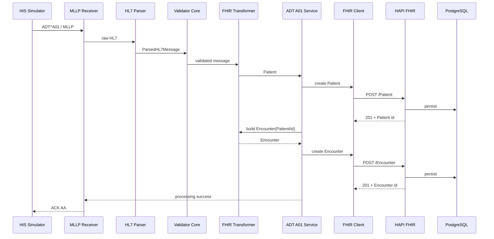

# Fluxo v0.1 — HL7v2 ADT^A01 para FHIR Patient e Encounter

## 1. Objetivo

Este documento descreve o primeiro fluxo funcional validado do Healthcare Integration Gateway: uma admissão hospitalar representada por `ADT^A01`, recebida via MLLP e convertida em `Patient` e `Encounter` FHIR R4.

## 2. Mensagem sintética usada

```text
MSH|^~\&|HIS_DEMO|HOSPITAL_DEMO|INTEGRATION_GATEWAY|HEALTHCARE_LAB|20260914231500||ADT^A01|MSG00001|P|2.5
EVN|A01|20260914231500
PID|1||789012^^^HOSPITAL_DEMO^MR||SANTOS^MARINA||19920810|F|||AVENIDA DEMO 100^^SALVADOR^BA^40000000^BRA||71999999999
PV1|1|I|WARD^101^A||||12345^SILVA^CARLOS||||||||||||VN00001|||||||||||||||||||||||||20260914231500
```

Todos os dados são fictícios.

## 3. Mapping implementado

### Patient

```text
PID-3  -> Patient.identifier
PID-5  -> Patient.name
PID-7  -> Patient.birthDate
PID-8  -> Patient.gender
PID-11 -> Patient.address
PID-13 -> Patient.telecom
MSH-10 -> Patient.meta.source
```

### Encounter

```text
PV1-19 -> Encounter.identifier
PV1-2  -> Encounter.class
PV1-3  -> Encounter.location
PV1-44 -> Encounter.period.start
Patient FHIR id -> Encounter.subject.reference
MSH-10 -> Encounter.meta.source
```

## 4. Fluxo end-to-end



## 5. Semântica temporal

O valor HL7 do exemplo:

```text
PV1-44 = 20260914231500
```

não possui timezone explícito.

Nesta fase, o projeto deliberadamente não inventa offset temporal. O mapping utiliza:

```text
Encounter.period.start = 2026-09-14
```

A decisão preserva apenas informação que existe de forma segura na origem.

## 6. Referência Patient → Encounter

O fluxo inicialmente foi testado com uma referência temporária. Depois da validação do POST de Patient, o service passou a capturar o ID real retornado pelo HAPI FHIR.

Execução validada:

```text
Patient/1057
Encounter/1058
Encounter.subject.reference = Patient/1057
```

Os números são IDs de uma execução local e não identificadores fixos do projeto.

## 7. ACK

O ACK passa a refletir o resultado do processamento do gateway.

Sucesso:

```text
MSA|AA|MSG00001|Message accepted
```

Falha de validação ou persistência:

```text
AE
```

Tipo de mensagem não suportado:

```text
AR
```

## 8. Rastreabilidade

O `MSH-10` é preservado como correlation id e também incorporado em:

```text
Patient.meta.source
Encounter.meta.source
```

Exemplo:

```text
urn:hl7v2:message:MSG00001
```

## 9. Critério de aceite

O fluxo foi considerado validado porque:

- o HIS Simulator enviou a mensagem sintética;
- a mensagem foi recebida por MLLP;
- Parser e Validator executaram;
- `Patient` foi criado;
- o ID FHIR real foi capturado;
- `Encounter` foi criado referenciando o Patient;
- ambos puderam ser recuperados pela API FHIR;
- PostgreSQL permaneceu saudável;
- o emissor recebeu `ACK AA`;
- 8 testes automatizados permaneceram passando.

## 10. Próxima evolução

O próximo trabalho não é mais conectar o caminho feliz, e sim endurecê-lo:

- idempotência;
- duplicate control;
- testes do FHIR Client e service;
- indisponibilidade do destino;
- retry;
- logs/auditoria estruturados;
- validação adicional de semântica e qualidade de dados.
