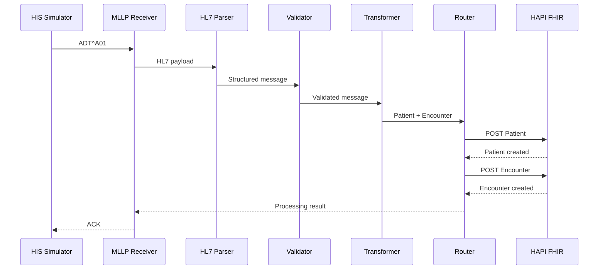

# Fluxo v0.1 — HL7v2 ADT^A01 para FHIR Patient e Encounter

## 1. Objetivo

Este documento descreve o primeiro fluxo funcional do Healthcare Integration Gateway.

O caso de uso escolhido é uma **admissão de paciente**, representada em HL7v2 pelo evento `ADT^A01`.

O objetivo é demonstrar, de ponta a ponta, como um evento gerado por um sistema hospitalar pode ser recebido, interpretado, validado e convertido em recursos FHIR.

---

## 2. Cenário de negócio

Um paciente é admitido em um hospital.

O HIS registra essa admissão e gera uma mensagem HL7v2 `ADT^A01`.

A mensagem contém dados administrativos do paciente e do atendimento.

Exemplo conceitual:

```text
Paciente admitido
      |
      v
HIS gera ADT^A01
      |
      v
Gateway recebe e processa
      |
      v
FHIR Patient + Encounter
```

---

## 3. Por que ADT^A01?

Eventos ADT são fundamentais em integrações hospitalares porque representam mudanças no ciclo administrativo do paciente.

O evento `A01` representa uma admissão/entrada.

Ele é adequado para o primeiro MVP porque envolve conceitos centrais:

- identificação do paciente;
- dados demográficos;
- atendimento;
- internação;
- unidade/leito;
- profissional associado;
- data/hora do evento.

Além disso, permite estudar um mapeamento natural entre HL7v2 e FHIR.

---

## 4. Mensagem de exemplo

Todos os dados abaixo são fictícios.

```text
MSH|^~\&|HIS_DEMO|HOSPITAL_DEMO|INTEROP_GATEWAY|LAB|20260910220000||ADT^A01|MSG000001|P|2.5
EVN|A01|20260910220000
PID|1||123456^^^HOSPITAL_DEMO^MR||SILVA^JOAO||19850315|M|||RUA DEMO 100^^SALVADOR^BA^40000000^BRA
PV1|1|I|UTI^101^01||||1234^SOUZA^MARIA|||||||||||ENC000001
```

---

## 5. Segmentos utilizados inicialmente

### MSH — Message Header

Cabeçalho da mensagem.

Informações importantes para o gateway:

- sistema emissor;
- instalação emissora;
- sistema receptor;
- data/hora;
- tipo de mensagem;
- identificador da mensagem;
- versão do HL7.

Campos relevantes no MVP:

```text
MSH-3  Sending Application
MSH-4  Sending Facility
MSH-7  Date/Time of Message
MSH-9  Message Type
MSH-10 Message Control ID
MSH-12 Version ID
```

### EVN — Event Type

Representa informações relacionadas ao evento administrativo.

No fluxo inicial utilizaremos principalmente o tipo e o timestamp do evento.

### PID — Patient Identification

Contém informações demográficas e de identificação do paciente.

Campos iniciais:

```text
PID-3 Patient Identifier List
PID-5 Patient Name
PID-7 Date/Time of Birth
PID-8 Administrative Sex
PID-11 Patient Address
```

### PV1 — Patient Visit

Representa informações relacionadas ao atendimento/visita/internação.

Campos iniciais previstos:

```text
PV1-2  Patient Class
PV1-3  Assigned Patient Location
PV1-7  Attending Doctor
PV1-19 Visit Number
```

---

## 6. Mapeamento conceitual HL7v2 -> FHIR

### Patient

```text
PID-3  -> Patient.identifier
PID-5  -> Patient.name
PID-7  -> Patient.birthDate
PID-8  -> Patient.gender
PID-11 -> Patient.address
```

### Encounter

```text
PV1-19 -> Encounter.identifier
PV1-2  -> Encounter.class
PV1-3  -> Encounter.location
PV1-7  -> Encounter.participant
PID-3  -> Encounter.subject -> Patient
```

O mapeamento real será implementado progressivamente e poderá exigir normalização de códigos e regras específicas.

---

## 7. Pipeline de processamento



---

## 8. Estado esperado em cada etapa

### 8.1 Recebimento

Entrada:

```text
HL7v2 raw message
```

Saída:

```text
payload extraído do framing MLLP
```

### 8.2 Parsing

Entrada:

```text
texto HL7v2
```

Saída conceitual:

```text
MSH
EVN
PID
PV1
```

com campos acessíveis pela aplicação.

### 8.3 Validação

Exemplos mínimos iniciais:

- MSH existe;
- `MSH-9` é ADT^A01;
- `MSH-10` existe;
- PID existe;
- `PID-3` existe;
- PV1 existe.

### 8.4 Transformação

Produção de dois recursos FHIR principais:

```text
Patient
Encounter
```

### 8.5 Entrega

Recursos enviados ao HAPI FHIR através de sua API REST.

### 8.6 Confirmação

O gateway gera uma resposta HL7 ACK indicando o resultado do processamento.

---

## 9. ACK e tratamento de resultado

O emissor precisa saber se a mensagem foi aceita.

No fluxo inicial trabalharemos com os conceitos:

```text
AA = Application Accept
AE = Application Error
AR = Application Reject
```

A política exata será implementada e documentada junto ao receiver.

Exemplo conceitual de sucesso:

```text
MSA|AA|MSG000001
```

O `Message Control ID` permite correlacionar o ACK com a mensagem original.

---

## 10. Rastreabilidade mínima

Cada execução deverá permitir correlacionar a mensagem desde a origem até o destino.

Campos iniciais desejados:

```text
message_id: MSG000001
message_type: ADT^A01
client_id: hospital_demo
status: processed
received_at: ...
processed_at: ...
patient_identifier: 123456
destination: hapi_fhir
fhir_patient_id: ...
fhir_encounter_id: ...
ack_code: AA
```

Não utilizaremos identificadores reais de pacientes nos exemplos públicos.

---

## 11. Cenários de erro que serão testados

O pipeline não será validado apenas pelo caminho feliz.

Casos previstos:

1. mensagem sem MSH;
2. mensagem com tipo não suportado;
3. ausência de `MSH-10`;
4. ausência de PID;
5. ausência de `PID-3`;
6. ausência de PV1;
7. FHIR Server indisponível;
8. resposta HTTP inesperada;
9. timeout;
10. reenvio da mesma mensagem.

Cada falha relevante deverá gerar evidência e documentação de troubleshooting.

---

## 12. Critério de aceite do fluxo

O fluxo ADT^A01 será considerado validado quando:

- uma mensagem sintética for enviada pelo simulador;
- for recebida via MLLP;
- o tipo ADT^A01 for identificado;
- os campos mínimos forem validados;
- Patient for criado no HAPI FHIR;
- Encounter for criado e relacionado ao Patient;
- os recursos puderem ser consultados posteriormente;
- um ACK coerente retornar ao emissor;
- logs permitirem acompanhar todo o processamento;
- os testes puderem ser repetidos de forma documentada.

---

## 13. Próxima etapa técnica

Antes de implementar o MLLP Receiver, será montado o ambiente local mínimo:

```text
Docker
  |
  +-- PostgreSQL
  |
  +-- HAPI FHIR R4
```

O objetivo é validar primeiro o destino da integração e a API FHIR.

Isso será documentado em `docs/implementation/01-local-fhir-environment.md`.
