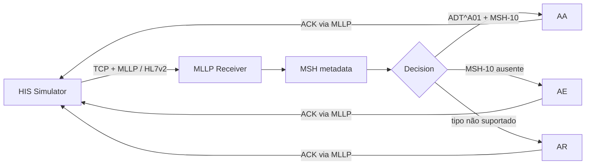

# Arquitetura — Fluxo MLLP + ACK

## Objetivo

Registrar o fluxo arquitetural introduzido no Milestone 1.3 e separar claramente transporte, interpretação mínima do `MSH`, decisão de acknowledgement e responsabilidades futuras do parser/validator desacoplados.

---

## Fluxo implementado



---

## Framing MLLP

```text
0x0B + HL7 MESSAGE + 0x1C + 0x0D
```

O TCP transporta um fluxo de bytes. O Receiver acumula esse fluxo em buffer e somente considera uma mensagem completa quando encontra o início e o terminador MLLP.

---

## Correlação

```text
Mensagem de origem
MSH-10 = MSG00001
       |
       v
Gateway
       |
       v
ACK
MSA-2 = MSG00001
```

A correlação foi validada no happy path com `MSG00001` e no cenário de rejeição com `MSG00002`.

---

## Decisão atual de ACK

```text
Mensagem recebida
      |
      v
MSH legível?
      |
      v
MSH-10 ausente? -------- sim ------> AE
      |
      não
      |
      v
MSH-9 != ADT^A01? ------- sim ------> AR
      |
      não
      |
      v
AA
```

Esta lógica é intencionalmente simples para o Milestone 1.3. Ela prova transporte e acknowledgement, mas ainda não representa o Validator Core definitivo.

---

## Estado arquitetural após o Milestone 1.3

```text
IMPLEMENTADO

HIS Simulator
      |
      | TCP / MLLP
      v
MLLP Receiver
      |
      +--> MSH metadata
      +--> AA / AE / AR
      |
      v
ACK para o emissor

HAPI FHIR R4
      |
      v
PostgreSQL
```

Os blocos MLLP e FHIR ainda não estão conectados ponta a ponta.

---

## Próxima evolução

No Milestone 1.4, responsabilidades hoje presentes no Receiver deverão ser extraídas:

```text
MLLP Receiver
      |
      v
HL7 Parser
      |
      v
Validator Core
      |
      v
ACK Decision
```

Princípio arquitetural:

> O Receiver deve conhecer transporte. O Parser deve conhecer estrutura HL7. O Validator deve conhecer regras de aceitação. O Transformer deverá conhecer mapeamento para FHIR.

Isso reduz acoplamento e permite testar cada responsabilidade isoladamente.
