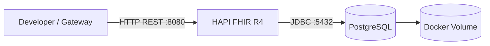

# Implementação 01 — Ambiente FHIR local

## 1. Objetivo

Criar o primeiro componente executável do Healthcare Integration Gateway: um ambiente FHIR R4 local, reproduzível e persistente, que servirá como destino das futuras transformações HL7v2 -> FHIR.

Nesta etapa ainda não existe MLLP, parser ou transformação HL7. O objetivo é garantir primeiro que o destino FHIR esteja operacional.

---

## 2. Por que começar pelo destino?

O pipeline v0.1 será:

```text
HIS Simulator
   -> MLLP
   -> Parser
   -> Validator
   -> Transformer
   -> Router
   -> HAPI FHIR
```

Antes de implementar os componentes anteriores, precisamos de um servidor FHIR funcional para testar recursos, operações REST, persistência e conectividade.

Isso reduz o número de variáveis durante o desenvolvimento: primeiro validamos o destino; depois adicionamos cada camada do pipeline.

---

## 3. Conceitos utilizados

### Docker

Docker permite executar aplicações em containers isolados e reproduzíveis. Em vez de instalar Java, HAPI FHIR e PostgreSQL diretamente no sistema operacional, cada aplicação será executada em seu próprio container.

### Docker Compose

Docker Compose descreve um conjunto de containers que trabalham juntos.

Nesta etapa teremos dois serviços:

```text
HAPI FHIR
    |
    | JDBC
    v
PostgreSQL
```

### HAPI FHIR

HAPI FHIR será o servidor FHIR do ambiente local. Ele expõe uma API REST compatível com FHIR e permitirá criar, consultar e atualizar recursos como `Patient` e `Encounter`.

### PostgreSQL

O PostgreSQL será a camada de persistência do HAPI FHIR. Separar aplicação e banco reproduz uma arquitetura mais próxima de ambientes reais.

---

## 4. Arquitetura desta etapa



O PostgreSQL não é publicado para o host nesta fase. Apenas o HAPI FHIR possui porta externa `8080`.

Isso reduz exposição desnecessária e demonstra o conceito de comunicação interna entre containers.

---

## 5. Arquivos

```text
docker/
├── docker-compose.yml
└── hapi.application.yaml
```

### `docker-compose.yml`

Responsável por definir:

- container PostgreSQL;
- container HAPI FHIR;
- dependência entre os serviços;
- health check do banco;
- volume persistente;
- rede interna;
- publicação da porta 8080.

### `hapi.application.yaml`

Responsável por configurar o HAPI FHIR:

- conexão JDBC;
- usuário e senha do banco;
- driver PostgreSQL;
- dialect Hibernate;
- versão FHIR R4.

---

## 6. Por que existe uma rede Docker?

A rede `healthcare-net` permite que os containers se comuniquem utilizando o nome do serviço como DNS interno.

O HAPI não utiliza `localhost` para acessar o PostgreSQL.

Ele utiliza:

```text
jdbc:postgresql://db:5432/hapi
```

`db` é o nome do serviço PostgreSQL no Docker Compose.

Importante:

```text
localhost dentro de um container = o próprio container
```

Portanto, usar `localhost:5432` no container HAPI procuraria um PostgreSQL dentro do próprio container HAPI, o que estaria incorreto.

---

## 7. Por que existe um volume?

Containers são descartáveis.

Sem volume, remover o container do PostgreSQL poderia remover também os dados armazenados dentro dele.

O volume:

```text
hapi-postgres-data
```

mantém os dados do banco fora do ciclo de vida do container.

Fluxo conceitual:

```text
Container PostgreSQL
        |
        v
Docker Volume
        |
        v
Dados persistentes
```

---

## 8. Health check e dependência

O banco executa periodicamente:

```bash
pg_isready -U admin -d hapi
```

O HAPI FHIR somente inicia depois que o PostgreSQL é considerado saudável.

Isso evita uma condição comum em arquiteturas containerizadas:

```text
Aplicação inicia
     |
     v
Banco ainda não está pronto
     |
     v
Erro de conexão
```

---

## 9. Executando o ambiente

Na raiz do repositório:

```bash
cd docker
```

Subir os serviços em background:

```bash
docker compose up -d
```

Verificar os containers:

```bash
docker compose ps
```

Acompanhar logs do HAPI:

```bash
docker compose logs -f fhir
```

Acompanhar logs do PostgreSQL:

```bash
docker compose logs -f db
```

---

## 10. Validação executada — inicialização dos serviços

Em 11/09/2026, o ambiente local foi executado com sucesso em Debian sobre WSL2 utilizando Docker.

O comando:

```bash
docker compose up -d
```

criou e iniciou os seguintes componentes:

```text
healthcare-net
hapi-postgres-data
healthcare-postgres
healthcare-hapi-fhir
```

A saída de `docker compose ps` confirmou:

```text
healthcare-postgres   Up (...) (healthy)
healthcare-hapi-fhir  Up (...)
```

O PostgreSQL foi inicializado com sucesso e apresentou nos logs:

```text
database system is ready to accept connections
```

O HAPI FHIR apresentou nos logs:

```text
Initializing HAPI FHIR restful server running in R4 mode
Tomcat started on port 8080 (http)
Started Application
```

### O que essa validação comprova?

Esta evidência demonstra que:

- a imagem PostgreSQL foi obtida e executada;
- a imagem HAPI FHIR foi obtida e executada;
- a rede Docker foi criada;
- o volume persistente foi criado;
- o health check do PostgreSQL está funcionando;
- o PostgreSQL aceita conexões;
- o HAPI FHIR inicia somente após a disponibilidade do banco;
- o HAPI foi iniciado em modo FHIR R4;
- o servidor HTTP está disponível na porta 8080.

Os avisos de locale exibidos pela imagem Alpine do PostgreSQL não impediram a inicialização nem alteraram o status `healthy` do serviço.

---

## 11. Validação 1 — CapabilityStatement

Quando o HAPI estiver inicializado, acessar:

```text
http://localhost:8080/fhir/metadata
```

ou utilizar:

```bash
curl http://localhost:8080/fhir/metadata
```

### O que estamos validando?

O endpoint `/metadata` retorna o `CapabilityStatement` do servidor.

Esse recurso descreve capacidades como:

- versão FHIR;
- recursos suportados;
- operações disponíveis;
- formas de interação REST.

Portanto, obter uma resposta FHIR válida nesse endpoint comprova que o servidor está operacional no nível da API, e não apenas que o processo Java está em execução.

---

## 12. Validação 2 — criar um Patient sintético

Criar um arquivo temporário `patient.json` ou utilizar diretamente a chamada abaixo:

```bash
curl -X POST http://localhost:8080/fhir/Patient \
  -H "Content-Type: application/fhir+json" \
  -d '{
    "resourceType": "Patient",
    "identifier": [
      {
        "system": "https://hospital-demo.local/mrn",
        "value": "123456"
      }
    ],
    "name": [
      {
        "family": "Silva",
        "given": ["Joao"]
      }
    ],
    "gender": "male",
    "birthDate": "1985-03-15"
  }'
```

Todos os dados são fictícios.

### Resultado esperado

Resposta HTTP de criação bem-sucedida, normalmente `201 Created`, contendo o recurso persistido e seu identificador FHIR.

---

## 13. Validação 3 — consultar o Patient

Pesquisar pelo identificador hospitalar:

```bash
curl "http://localhost:8080/fhir/Patient?identifier=123456"
```

Resultado esperado:

- `Bundle` FHIR de busca;
- paciente criado presente no resultado;
- dados preservados após persistência.

---

## 14. Teste de persistência

Parar os containers:

```bash
docker compose down
```

Subir novamente:

```bash
docker compose up -d
```

Executar novamente a busca:

```bash
curl "http://localhost:8080/fhir/Patient?identifier=123456"
```

Se o recurso continuar disponível, validamos que o volume PostgreSQL está preservando os dados.

> Não utilizar `docker compose down -v` neste teste, pois `-v` remove o volume e consequentemente os dados persistidos.

---

## 15. O que esta etapa comprova

Ao concluir esta etapa teremos comprovado:

- execução de HAPI FHIR em container;
- execução de PostgreSQL em container separado;
- comunicação entre containers através de rede interna;
- configuração JDBC;
- persistência através de Docker Volume;
- disponibilidade da FHIR REST API;
- criação e consulta de um recurso FHIR R4.

---

## 16. Evidências recomendadas

Salvar evidências sem dados reais de pacientes.

Sugestões:

1. `docker compose ps` mostrando os serviços ativos;
2. resposta de `/fhir/metadata`;
3. POST de `Patient` com HTTP 201;
4. busca do Patient pelo identificador sintético;
5. consulta realizada novamente após reiniciar os containers.

As imagens poderão ser armazenadas em:

```text
assets/evidence/mvp-v0.1/local-fhir/
```

---

## 17. Troubleshooting inicial

### Porta 8080 ocupada

Sintoma:

```text
bind: address already in use
```

Diagnóstico:

outra aplicação já está utilizando a porta 8080.

Ação:

identificar o processo ou alterar temporariamente o mapeamento no Compose, por exemplo:

```yaml
ports:
  - "8081:8080"
```

### HAPI não conecta ao banco

Verificar:

```bash
docker compose ps
docker compose logs db
docker compose logs fhir
```

Confirmar que o datasource aponta para:

```text
jdbc:postgresql://db:5432/hapi
```

### Recurso desapareceu após reinício

Verificar se foi utilizado:

```bash
docker compose down -v
```

O parâmetro `-v` remove volumes e é apropriado apenas quando desejamos resetar completamente o banco.

---

## 18. Segurança

As credenciais `admin/admin` existem apenas para desenvolvimento local.

Elas não são apropriadas para piloto ou produção.

Antes de qualquer uso real deverão ser substituídas por mecanismos seguros de configuração e gestão de segredos.

Nenhum dado real de paciente deve ser utilizado neste ambiente público.

---

## 19. Critério de conclusão

- [x] PostgreSQL saudável.
- [x] HAPI FHIR em execução.
- [ ] `/fhir/metadata` respondendo.
- [ ] Patient sintético criado.
- [ ] Patient recuperado via busca.
- [ ] Patient permanece disponível após reinício dos containers.
- [ ] Evidências finais registradas.

Depois disso, o próximo componente será o **HIS Simulator + mensagem HL7v2 ADT^A01**.
