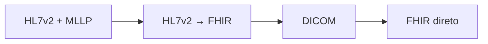

# Roadmap de aprendizado

## Trilha concluída

| Etapa | Status | Resultado |
|---|---|---|
| Ingesting HL7v2 Data with the Healthcare API | Concluída | Mensagem HL7v2 recebida por MLLP e persistida no HL7v2 Store |
| Streaming HL7 to FHIR Data with Healthcare API | Concluída | Dados HL7v2 convertidos em FHIR e disponibilizados no BigQuery |
| Ingesting FHIR Data with the Healthcare API | Próxima | Criar, importar, consultar e gerenciar recursos FHIR diretamente |
| Ingesting DICOM Data with the Healthcare API | Concluída | Estudos importados no DICOM Store, metadados exportados e consultados no BigQuery |

## Próximo laboratório: FHIR

A prioridade é praticar a ingestão direta de FHIR.

Isso complementa o lab de streaming ao mostrar o caminho em que uma aplicação já produz ou consome recursos FHIR via API REST, sem depender de uma mensagem HL7v2 na origem.

Pontos esperados de aprendizado:

- estrutura de recursos como `Patient`, `Observation`, `Encounter` e `MedicationRequest`;
- criação e consulta via API REST;
- organização de dados clínicos em FHIR Store;
- diferenças entre integração baseada em mensagens e integração baseada em recursos;
- noções de busca, versionamento e validação.

## DICOM concluído

O laboratório de DICOM completou a terceira modalidade principal da Healthcare API.

Resultados registrados:

- DICOM Store criado e estudos públicos importados;
- segundo store provisionado por REST autenticada;
- metadados exportados e consultados no BigQuery;
- troubleshooting de IAM e dataset documentado;
- relação com PACS/RIS registrada em [Lab 03](03-ingesting-dicom.md).

## Competência resultante

Ao concluir a trilha, o portfólio cobrirá as três modalidades principais de dados em saúde:

| Modalidade | Papel | Sistemas comuns |
|---|---|---|
| HL7v2 | Eventos e mensageria clínica | HIS, LIS, EHR, integração legada |
| FHIR | Recursos clínicos e APIs modernas | Aplicativos, portais, integrações digitais |
| DICOM | Imagens médicas | PACS, RIS, radiologia e diagnóstico por imagem |

## Próximos aprofundamentos recomendados

1. Perfis, extensões e terminologias FHIR;
2. LGPD, segurança, auditoria e desidentificação;
3. observabilidade de integrações clínicas;
4. qualidade de dados, reprocessamento e idempotência;
5. dashboards de integração e indicadores operacionais;
6. arquitetura híbrida entre datacenter hospitalar e cloud.
