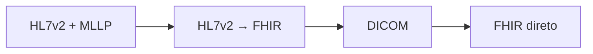

# Roadmap de aprendizado

## Trilha concluída

| Etapa | Status | Resultado |
|---|---|---|
| Ingesting HL7v2 Data with the Healthcare API | Concluída | Mensagem HL7v2 recebida por MLLP e persistida no HL7v2 Store |
| Streaming HL7 to FHIR Data with Healthcare API | Concluída | Dados HL7v2 convertidos em FHIR e disponibilizados no BigQuery |
| Ingesting FHIR Data with the Healthcare API | Concluída | Recursos FHIR R4 importados, desidentificados, exportados e transmitidos ao BigQuery |
| Ingesting DICOM Data with the Healthcare API | Concluída | Estudos importados no DICOM Store, metadados exportados e consultados no BigQuery |

## FHIR direto concluído

O laboratório complementou a conversão HL7v2 → FHIR ao demonstrar o fluxo em que aplicações produzem e consomem recursos FHIR diretamente pela API REST.

Resultados registrados:

- FHIR Stores R4 principal e desidentificado criados;
- recursos importados do Cloud Storage;
- exportação em massa e streaming contínuo para BigQuery;
- recursos `Patient` criados por API REST;
- desidentificação validada em uma camada analítica separada;
- relação completa registrada em [Lab 04](04-ingesting-fhir.md).

## DICOM concluído

O laboratório de DICOM completou a terceira modalidade principal da Healthcare API.

Resultados registrados:

- DICOM Store criado e estudos públicos importados;
- segundo store provisionado por REST autenticada;
- metadados exportados e consultados no BigQuery;
- troubleshooting de IAM e dataset documentado;
- relação com PACS/RIS registrada em [Lab 03](03-ingesting-dicom.md).

## Competência resultante

Ao concluir a trilha, o portfólio cobrirá as três modalidades principais de dados em saúde:

| Modalidade | Papel | Sistemas comuns |
|---|---|---|
| HL7v2 | Eventos e mensageria clínica | HIS, LIS, EHR, integração legada |
| FHIR | Recursos clínicos e APIs modernas | Aplicativos, portais, integrações digitais |
| DICOM | Imagens médicas | PACS, RIS, radiologia e diagnóstico por imagem |

## Próximos aprofundamentos recomendados

1. Perfis, extensões e terminologias FHIR;
2. LGPD, segurança, auditoria e desidentificação;
3. observabilidade de integrações clínicas;
4. qualidade de dados, reprocessamento e idempotência;
5. dashboards de integração e indicadores operacionais;
6. arquitetura híbrida entre datacenter hospitalar e cloud.
